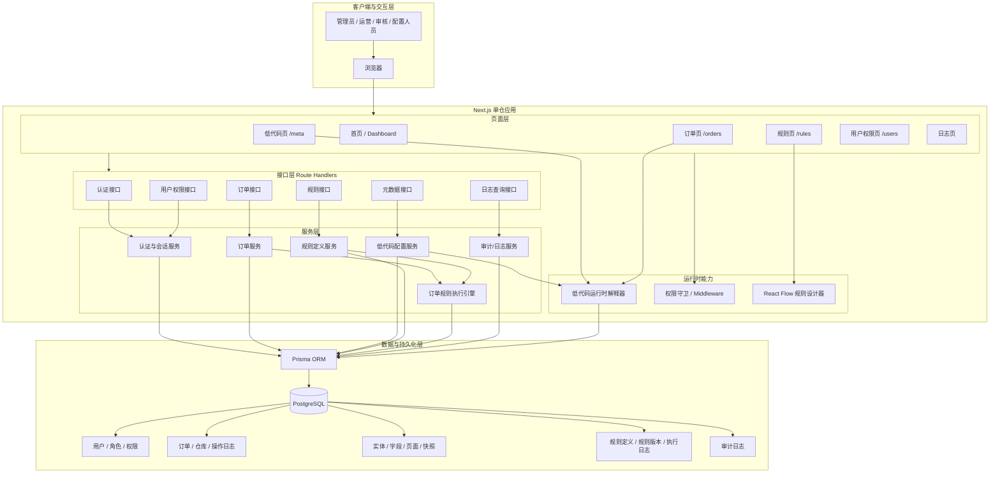
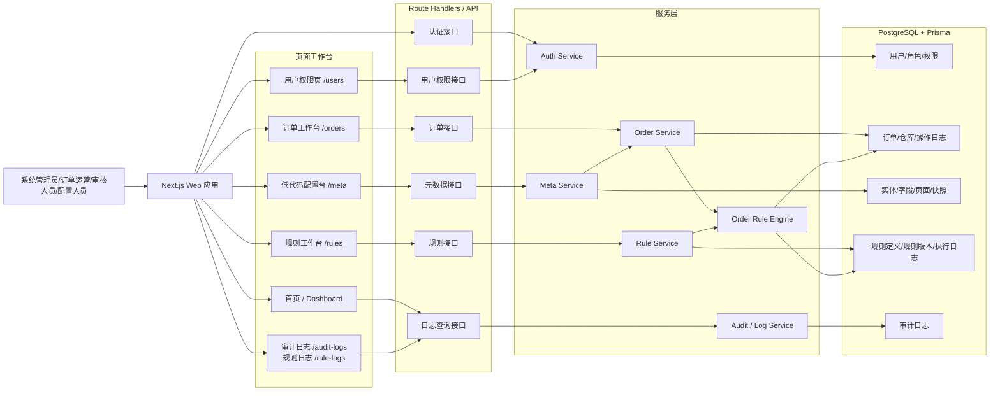
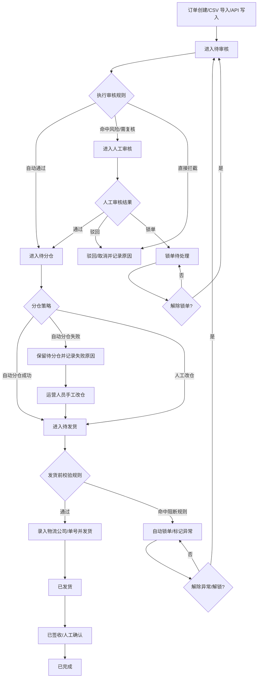
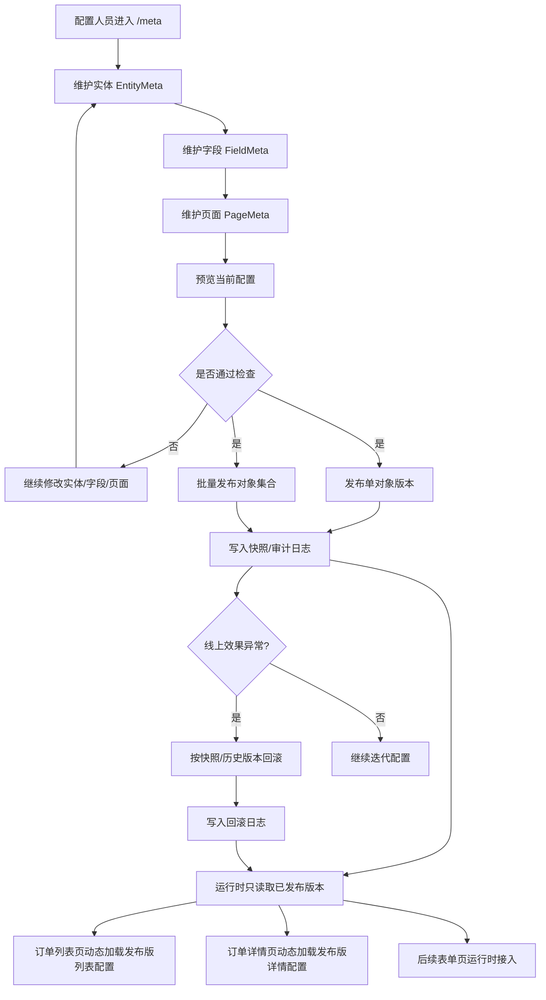
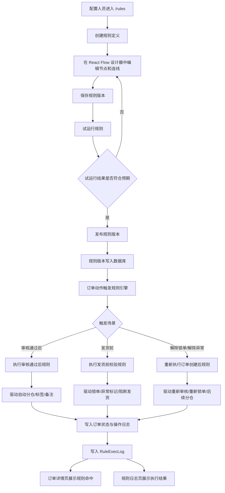

# 项目流程图

> 用于快速说明当前项目的系统结构、项目架构、订单主链路、低代码配置链路和规则执行链路。  
> 渲染方式：建议在支持 Mermaid 的 Markdown 预览器中查看。

| 项目 | 内容 |
| --- | --- |
| 文档用途 | 对齐项目整体流程与模块关系，便于汇报、设计评审和后续开发 |
| 适用范围 | 当前仓库已实现和正在推进的 `P0 / P1` 主流程 |
| 更新时间 | 2026-04-18 |

## 1. 项目架构图

## 2. 系统总览流程图

## 3. 订单主流程图

## 4. 低代码配置流程图

## 5. 规则设计与执行流程图

## 6. 当前阅读建议

- 看技术设计或做系统汇报时，优先使用“项目架构图”。
- 看汇报或讲项目时，优先使用“系统总览流程图”。
- 讲业务闭环时，优先使用“订单主流程图”。
- 讲低代码平台时，优先使用“低代码配置流程图”。
- 讲规则引擎时，优先使用“规则设计与执行流程图”。

## 7. 说明

- 本文档描述的是当前仓库已经实现或已明确规划到下一阶段的主流程，不包含所有 `P2` 扩展项。
- 若后续补上低代码表单页运行时、规则表达式库、多分支执行器，应优先同步更新本文件。

---

返回入口：[README](../README.md) | 相关内容：[需求文档](requirements.md) / [技术路线文档](tech-roadmap.md) / [进度记录](progress.md)
