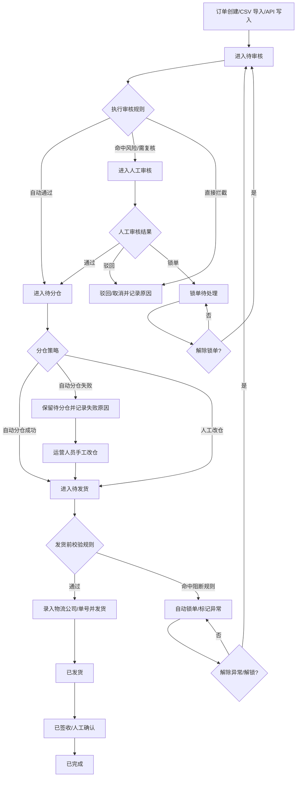
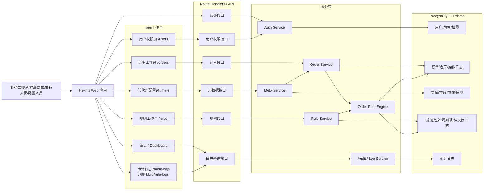
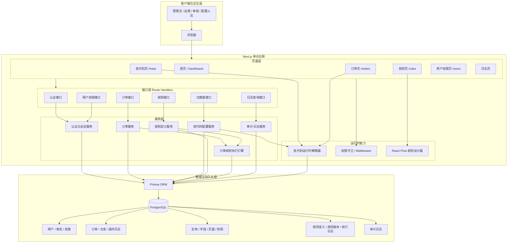
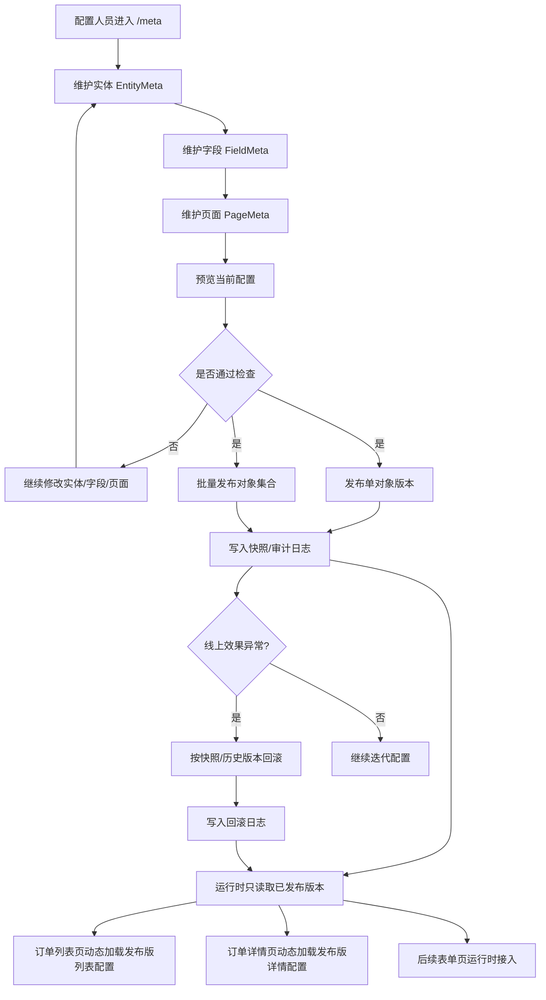
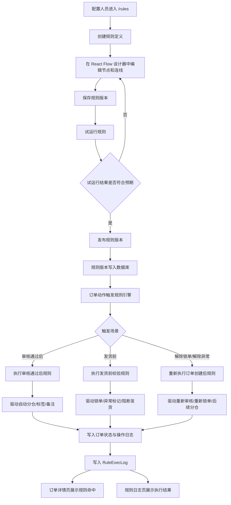

**本科毕业论文（设计）**

|     |     |
| --- | --- |
| **题 目** | **面向中小电商的低代码订单管理系统的设计与实现** |
| **姓 名** | **王浩** |
| **学 号** | **220591134** |
| **年级班级** | **22软件工程（本科）（精英计划）** |
| **指导教师** | **李玉红** |
| **职 称** | **讲师** |
| **学 院** | **人工智能与大数据学院** |

武汉商学院印制

毕业论文（设计）诚信承诺书

本人郑重承诺：

(1)本论文（设计）是在指导教师的指导下，查阅相关文献，进行分析研究，独立撰写而成的；

(2)本论文（设计）中，所有实验、数据和有关材料均是真实的；

(3)本论文（设计）中除引文和致谢的内容外，不包含其他人或机构已经撰写发表过的研究成果；

(4)本论文（设计）如有剽窃他人研究成果的情况，本人愿承担一切责任。

毕业论文(设计)作者签名：

签字日期：2026年5月1日

毕业论文（设计）版权使用授权书

本毕业论文（设计）作者完全了解武汉商学院有关保留、使用毕业论文（设计）的规定。本毕业论文（设计）的知识产权属武汉商学院所有，本人同意学校保留并向国家有关部门或机构送交毕业论文（设计）的复印件和电子版，允许毕业论文（设计）被查阅和借阅。

本人授权武汉商学院可以将本毕业论文（设计）的全部或部分内容编入数据库进行检索，可以采用影印、缩印或扫描等复制手段保存、汇编本毕业论文（设计）。

本人毕业后发表与本毕业论文（设计）研究有关的文章，作者单位署名应为“武汉商学院”，可以在备注中注明本人现工作单位。本毕业论文（设计）的研究成果的知识产权归武汉商学院，未经指导教师和武汉商学院同意，本人不私自从事与本毕业论文（设计）有关的盈利性活动。

毕业论文(设计)作者签名:

签字日期：2026年5月1日

面向中小电商的低代码订单管理系统的设计与实现

学生：王浩，人工智能与大数据学院

指导老师：李玉红，人工智能与大数据学院

摘要：在直播电商、社交电商以及跨境电商等新型业态的影响下，中小电商企业面临的订单量大幅增加、商品种类多样化以及促销活动频繁等问题给传统的订单管理方式带来巨大压力。由于受到人手不足、财力有限、技术力量薄弱等多方面因素影响，大部分小企业和微型企业仍然使用Excel或者一般的ERP来完成日常的工作任务，这使得公司的业务流程断层严重、信息孤岛现象明显并且不利于整个公司的发展壮大。为了改善这种情况，本文以低代码为思想基础，根据中小电商企业在订单履行方面的具体需求进行分析后，实现了一个基于低代码平台的订单管理系统的设计与开发工作，以此提高系统的智能化程度以及企业的运营管理水平。本系统基于订单全生命周期设计理念开发，包括订单管理系统后台服务、低代码开发平台以及可视化规则设计器三个主要部分，在此基础上实现对整个订单处理过程自动化管理和自定义元数据、业务规则。同时具有良好的可扩展性和兼容性，可以很好地适应各种不同的应用场景。为了符合客户需求，项目主要针对订单重要步骤可追溯性、安全性以及可复原性进行了加强改进，并利用配置管理、版本管理和历史恢复等手段极大地提高了系统的易用性和可靠性。本项目技术栈使用TypeScript开发一个全栈统一代码库，在前端和后端之间使用Next.js进行整合。使用Ant Design Pro进行后台管理页面的设计，使用Supabase PostgreSQL进行数据存储，使用Prisma ORM建立数据库表之间的关系。在可视化组件上使用React Flow来开发自定义规则编辑器以及节点化的布局等功能模块。这极大地降低从前端到后端的传统前后端分离模式下需要进行的各种工作，有利于原型系统的快速迭代和部署。本研究以“核心功能优先，后续逐步完善”的思路，采取最小可行性产品（MVP）迭代的方式开展工作，在订单系统中主要关注身份认证、交易结算、元数据管理、规则设置以及上线部署等方面的工作。从实验结果来看，此方案可以较好地解决中小型电商企业在订单管理上所面临的问题，保证重要业务正常运转的同时也大大提高了工作效率并且节约成本，这对推动小企业发展大有裨益。

。

关键词：中小电商；低代码平台；订单管理系统；规则编排

Abstract**:**Under the influence of emerging business forms such as live-streaming e-commerce, social e-commerce, and cross-border e-commerce, small and medium-sized e-commerce enterprises are facing a sharp increase in order volume, greater diversity of product categories, and more frequent promotional activities, which has placed considerable pressure on traditional order management approaches. Due to limitations such as insufficient manpower, limited financial resources, and weak technical support, many small and micro enterprises still rely on Excel or general ERP systems to handle their daily operations. This often leads to fragmented business processes, obvious information silos, and restrictions on the long-term development of enterprises. In order to address these problems, this paper takes low-code as the basic idea and, based on an analysis of the specific needs of small and medium-sized e-commerce enterprises in order fulfillment, designs and develops an order management system based on a low-code platform, so as to improve the intelligence level of the system and enhance enterprise operation and management efficiency.

The system is developed based on the concept of full lifecycle order management and consists of three main parts: the order management backend service, the low-code development platform, and the visual rule designer. On this basis, it realizes automated management of the entire order processing workflow, as well as customization of metadata and business rules. At the same time, the system has good extensibility and compatibility, enabling it to adapt to different application scenarios. In order to better meet user needs, the project places particular emphasis on improving the traceability, security, and recoverability of key order-processing steps, and significantly enhances system usability and reliability through configuration management, version management, and historical rollback mechanisms.

In terms of technical implementation, this project adopts TypeScript to build a unified full-stack codebase and uses Next.js to integrate the frontend and backend. Ant Design Pro is used to design the backend management interface, Supabase PostgreSQL is used for data storage, and Prisma ORM is applied to establish relationships among database tables. For visual components, React Flow is used to develop a custom rule editor and node-based layout modules. This significantly reduces the amount of coordination work required in the traditional frontend-backend separation model, which is beneficial for the rapid iteration and deployment of the prototype system. Following the idea of “prioritizing core functions and improving the system step by step,” this study adopts a minimum viable product (MVP) iterative approach, mainly focusing on identity authentication, transaction settlement, metadata management, rule configuration, and online deployment in the order system. Experimental results show that this solution can effectively address the order management problems faced by small and medium-sized e-commerce enterprises. While ensuring the normal operation of key business processes, it also improves work efficiency and reduces costs, which is of positive significance for promoting the development of small enterprises.

**Key words:**small and medium-sized e-commerce enterprises; low-code platform; order management system; rule orchestration

目录

摘要 I

Abstract II

1绪论 1

1.1 研究背景与意义 1

1.2 国内外研究现状 1

1.3 研究方法和内容 2

1.3.1 研究方法 3

1.3.2 研究内容 3

2相关技术与理论基础 4

2.1 Next.js全栈框架技术概述 4

2.1.1 Next.js App Router 4

2.1.2 Route Handlers与全栈单仓模式 4

2.2前端与可视化开发技术 4

2.2.1 Ant Design与ProComponents 4

2.2.2 React Flow可视化编排技术 5

2.3数据与后端支撑技术 5

2.3.1 Supabase PostgreSQL 5

2.3.2 Prisma ORM 6

2.3.3 Zod运行时校验 6

2.4 低代码与元数据驱动理论 6

2.4.1 元数据建模思想 6

2.4.2 动态渲染机制 7

2.5 规则引擎相关理论 7

2.5.1 可视化规则编排 7

2.5.2 规则执行与版本治理 7

2.6本章小结 8

3系统需求分析 8

3.1 业务需求分析 8

3.2 用户角色分析 9

3.3 功能需求分析 9

3.3.1订单管理后台需求 10

3.3.2低代码配置平台需求 10

3.3.3可视化规则编排引擎需求 11

3.4 流程需求分析 12

3.5 非功能性需求分析 12

3.6 可行性分析 13

3.7本章小结 14

4系统总体设计 14

4.1 系统设计原则和目标 14

4.2 系统架构设计 14

4.2.1技术架构设计 15

4.2.2分层架构设计 15

4.2.3功能架构设计 16

4.3 系统功能模块设计 16

4.3.1用户与权限模块设计 17

4.3.2订单管理模块设计 17

4.3.3低代码配置模块设计 18

4.3.4规则编排模块设计 19

4.3.5日志与审计模块设计 19

4.4 数据库设计 20

4.4.1概念结构设计 20

4.4.2主要数据表设计 21

4.5 接口与部署设计 21

4.5.1接口模块划分 22

4.5.2部署方案设计 22

4.6本章小结 23

5系统详细设计与实现 23

5.1 开发环境的搭建 23

5.2 核心功能模块实现 24

5.2.1 用户与权限模块实现 25

5.2.2 订单管理模块实现 26

5.2.3 低代码配置模块实现 29

5.2.4 规则编排模块实现 30

5.2.5 日志与审计模块实现 32

5.3 关键业务流程实现 32

5.3.1 订单审核流程实现 33

5.3.3 字段配置与动态渲染实现 35

5.3.4 规则试运行与发布回滚实现 36

5.4 系统测试与验收 37

5.4.1 功能测试 38

5.4.2 验收结果分析 38

5.5本章小结 39

6总结与展望 39

6.1工作总结 39

6.2主要成果与创新点 40

6.3不足与展望 41

参考文献 41

致谢 43

# 1绪论

## 1.1 研究背景与意义

近年来，随着直播电商、社交电商、跨境电商等新业态出现，使中小电商企业的订单获取、履约执行、营销推广等方面呈现出多元化趋势。传统订单管理系统已经发展成为集审核、锁定库存、多仓库协同调度、异常处理、日志记录和活动相关联的一体化解决方案。相比于大企业来说，这些小微企业一般面临人员不足、资金短缺以及商业模型变化较快等问题，现有的信息系统无法满足其正常运转的需求。目前，一些公司还采用Excel表格或者第三方软件来进行日常经营工作，造成业务脱节的现象严重，数据孤岛现象普遍，不利于打破系统间壁垒进行数据融合和深入挖掘，从而影响企业信息化进程。开发面向中小电商企业的低代码订单管理系统具有重要的现实意义同时也富有很高的学术价值。该系统旨在解决传统模式下工作效率低下以及操作繁杂的问题，通过元数据管理和动态可视化展示加上基于规则的决策支持三个主要部分来提高订单管理工作的效率大大减少人力资源并且提升风险防范水平。从实用的角度来看，它可以给同类企业进行数字化转型起到很好的借鉴作用；而从学术层面来讲，它也有利于促进低代码技术在电子商务领域的更深层次的研究和发展。

## 1.2 国内外研究现状

近年来低代码开发以及其在企业业务系统中应用日益受到广泛关注，是当前软件工程及企业管理领域热点问题。Bock和Frank认为低代码平台大幅降低应用开发复杂性以及加快业务系统更新换代周期，使得普通员工也可进行编程工作\[1\]。Bucaioni等人也指出虽然低代码工具已经广泛应用于各个行业，但是大多数学者主要关注模型驱动设计、可视化建模、元数据管理以及平台架构等问题上，在针对某些特定行业定制化需求上还不够充分，需要进一步研究来提高其适用范围\[2\]。Kluza与Nalepa提出的结合业务流程以及规则的一体化建模方法论对于流程化并且规则密集型应用系统的设计有很好的指导作用\[3\]。而Wang等人则是基于流程模型与规则表示的一致性角度来分析这种一致性给人们认识这个系统带来的便利性和改善管理系统的效果\[4\]。

近年来，国内有关低代码开发平台以及快速应用开发工具的研究逐渐增多。盛振华从技术角度出发，详细介绍了低代码建模平台中的可视化设计、配置驱动架构以及模块化部署等内容及其相互关系\[5\]；郭文学从Web前端框架的角度出发，探讨了模型抽象程度与前端渲染速度的关系并对其对开发速度的影响进行了一定程度的研究\[6\]；裴太强等通过结合具体实例说明这类技术不仅可以极大地提高工作效率还可以大大减少维护费用，因而具有较好的经济效益以及良好的发展前景\[7\]。以上工作都为相关领域的发展做出了贡献。谷绍金等人给出一种基于元数据物资仓储管理系统设计方案，认为元数据建模有利于提高系统灵活性以及可扩展性\[8\]。对于订单处理与履约协同相关研究工作，在国内学者当中大多数是运用传统的ERP系统或者OMS系统进行研究，也有部分学者使用自己开发平台进行研究。邵鑫玉基于新零售理念下提出一种包含订单管理、库存管理和财务管理等功能模块云端仓储方案，体现了订单履约向多方合作发展趋势\[9\]。而焦涵是从电商物流拣选角度出发对各种不同的订单分派算法对于仓库作业效率所起作用进行详细阐述\[10\]。以上成果都给今后相关研究起到一定借鉴意义。余银明对互联网金融风控的研究，在此基础上提出一种基于工作流配置的管理系统，实现了业务逻辑与规则逻辑解耦，提高系统的运行速度并且有很好的工程实践意义。池炜成等人的微服务框架下的研究成果，实现了一个规则平台以及它的一个迁移方案，给规则单独部署以及实时更新提供可能。虽然目前市场上已经有很多成熟的订单管理系统，如订单管理、仓库管理和配送协同和数据分析等功能都已具备，但是这些系统对于字段可扩展性、页面自动生成、规则版本控制、图形化界面操作以及事件回溯上还欠缺统一的整体解决方案。目前国内外研究者对于低代码领域研究成果丰富，其主要集中在以下几个方面：一是低代码平台设计理念；二是基于元数据技术支持；三是业务规则全生命周期管理问题，如平台架构设计优化、模型一致性保证方法、规则动态变更策略等问题均受到广泛关注并取得一定进展\[1-4\]。而我国学者在低代码应用范围扩展、数据库优化手段及业务流程自动化研究方面也有所涉及\[5-12\]，但缺乏针对订单全流程管理要求进行高度灵活配置并融合可视化规则引擎相关工作。因此本文旨在针对中小企业电商订单履行过程中各种复杂情况，开发出一款具有良好伸缩性、易维护性和完善订单管理体系轻量级低代码订单管理系统，这不仅有很强理论意义而且有着较大实用价值。

## 1.3 研究方法和内容

本文采用系统方法进行研究，在“需求分析—设计—实现—测试”四个步骤基础上完成。根据项目的需求文档、技术要求文件及开发计划等相关材料对系统功能定位及其各个部分之间的联系做出明确阐述并选取适当的技术方案作为支撑。利用原型系统对低代码开发方式、动态可视化组件生成方式以及业务规则引擎进行测试，在订单管理上取得一定进展并最终产生既有理论意义又有实用价值的研究成果。

### 1.3.1 研究方法

本论文采用多种方式展开研究工作。首先通过对相关文献查阅总结归纳得出低代码开发平台、元数据管理和规则引擎的基本概念以及它们在订单管理系统中作用；其次根据结构化思路将中小规模电子商务公司订单处理过程分解为不同部分，确定每个部分任务分工、工作流程、状态变化和规则要求，从而形成较为完整系统功能结构；然后利用原型法不断改进和完善主要功能模块，包括用户登录、订单管理和可视化编程以及智能化决策支持等功能；最后采用多角度测试手段（包括单元测试、集成测试和压力测试）对各个部分进行充分检验，来评估系统的有效性以及实用性。

### 1.3.2 研究内容

本文主要针对中小电商企业订单履行中所包含的重要部分进行研究，如订单接收、审核分拣、库存管理、配送安排、售后服务等重要内容，在明确目标的基础上对每个业务点的需求进行分析并提出解决方案，在技术上使用TypeScript来搭建前后端分离分布式系统，采用关系型数据库或者非关系型数据库保存业务信息并且设计灵活的数据结构以便后续各种查询操作，在前端使用低代码平台定制化页面以及使用规则引擎提高业务逻辑执行速度从而大大增强系统的灵活性以及易用性。本课题基于搭建实验环境对整个系统进行一系列的功能性测试及性能测试，以便更好地检验本文提出方案对于业务流程整合、资源分配的速度以及实施的可能性等实际应用情况。研究成果不仅有利于开发出更优更强的订单管理系统，而且对今后的研究工作具有极大的参考价值。

# 2相关技术与理论基础

## 2.1 Next.js全栈框架技术概述

由于是基于React技术栈开发的功能完备框架，因此Next.js通过对页面渲染、数据通信、路由控制以及API等功能进行统一管理来改进传统的单页应用程序的设计理念。有文献报道，在与主流前端框架相比时，Next.js具有更快的服务端渲染速度、更低的第一屏加载时间和更好的搜索引擎可访问性和项目结构合理性的优点\[13-14\]。而在需要呈现商品信息、后台管理和各种各样的RESTful API的情况下使用基于Next.js的一站式解决方案可以大大降低前后端开发人员之间的沟通成本并且提高前端组件之间的协作效率以及整个项目的开发感受。

### 2.1.1 Next.js App Router

围绕 React/Next.js 的工程实践研究表明，基于文件系统的路由组织、布局复用和服务端渲染机制有助于增强页面结构清晰度与模块复用能力\[13\]。因此，本系统在页面组织上按照“登录、订单、低代码配置、规则编排”等业务模块拆分目录结构，并借助布局复用与页面共置能力减少重复模板代码，提高首屏渲染效率和页面维护性。

### 2.1.2 Route Handlers与全栈单仓模式

相关研究表明，Next.js由于其具有服务端渲染能力和React组件化的优势，在一个框架中完成页面搭建、路由配置以及数据流的操作，大大降低前后端合作的成本。而本项目使用全栈式开发方式，所有的页面组件、API接口、校验规则等都用TypeScript进行声明，所以避免了一些因为字段对应不上造成的问题。以上这些技术手段为订单、权限、监控、下发等功能提供坚实的基础。

## 2.2前端与可视化开发技术

由于是企业管理的重要工具，中小电商订单管理系统在大量信息展示的情况下，需要有良好的一致性视觉效果，在规则配置的功能上要提高用户体验降低操作难度。根据文献显示使用React框架开发的组件化可以大大增加企业级前端系统可重用性和可维护性以及性能问题（参考文献\[15-17\]）。本文主要从企业级组件库的应用改善页面外观以及基于节点式的编辑器来搭建复杂的逻辑从而达到符合标准的技术指标并且可以根据客户需求进行个性化的配置的目的。

### 2.2.1 Ant Design与ProComponents

企业级中后台界面设计及开发主要是基于组件化以及设计系统相关理念完成。由文献可知，在React基础上，通过组件化以及动态表单方式，可极大提高页面元素复用率，提升视觉风格一致性，解决多设备兼容性等问题（文献\[15,16\]）。而在实际工作中，使用Ant Design、ProComponents等完善前端UI组件库，可迅速搭建出订单管理系统、筛选区域、数据展示卡片、交互控件布局以及后台导航等重要部分，大大降低前端工程师工作量同时使产品具有专业性与统一性。

### 2.2.2 React Flow可视化编排技术

可视化规则编排主要是为了实现以节点形式进行图形交互设计并能绘制图结构。文献\[17\]指出，基于React框架开发可视化编辑器可以方便地实现节点拖拽、连线管理、增删操作、图结构序列化等功能。而从本文系统技术实现角度上讲，规则节点、连接边以及场景分支都具有明显的图数据特征，使用这种方式进行节点编辑不仅可以清楚地看到“条件判断-动作执行-结果反馈”之间的联系而且也为之后节点增加、调试测试和路径跟踪等提供良好的可视化基础。

## 2.3数据与后端支撑技术

该系统的设计必须考虑结构化与非结构化的数据管理。从数据层面看，需要有常规业务数据（比如订单、客户以及仓库等）还有多种不同类型的半结构化配置资源（比如页面Schema、字段属性定义、规则逻辑模型以及操作日志等）。为了能够提供良好的数据读写能力，在选择技术栈的时候要充分考虑到关系型数据库对于事务的一致性和复杂的关联查询优化的优势以及它对于JSON或者JSONB类型的支持情况。而根据相关资料表明，PostgreSQL由于其优秀的复杂对象支持、完善的关系型数据库事务管理和出色的横向可扩展性，在同类产品中处于领先地位，而且其中的JSON数据类型已经相当完善，完全可以满足我们的要求。因此，在本项目中我们使用PostgresQL数据库并利用ORM以及运行时Schema验证实现后端服务。

### 2.3.1 Supabase PostgreSQL

本项目使用Supabase PostgreSQL作为主要数据库，而PostgreSQL由于强大的技术能力起到重要作用。据相关资料表明，PostgreSQL对于复杂的的数据类型有明显的优势特别是在处理JSON格式以及半结构化的数据上有着不错的表现\[18, 19\]。因此，在低代码订单管理系统开发中，可以将订单的基本信息、用户的权限信息以及操作日志等结构化的数据用传统的关系型数据库来保存；而对于页面布局定义、业务逻辑映射以及动态扩展属性等非结构化或者半结构化的数据则可以用JSONB字段来进行高效地管理和存储。因此，在本系统中采用“关系表+JSONB元数据”可获得较好查询效率及灵活性。

### 2.3.2 Prisma ORM

Prisma OR是一种基于TypeScript 的模式驱动型数据访问框架，在Node.js 中的应用大大提高了开发效率并且很好地解决模型变更及查询优化等问题。作为一种面向对象关系映射（ORM）解决方案，Prisma 减少了与数据库之间的工作量并且提供一致的数据访问方式以及严格类型检查，有利于软件项目的开发和发展\[20\]。本文所开发的信息管理系统包括用户管理、权限管理、事务管理、参数管理、规则管理和日志管理等功能模块，都使用了一个 Schema 实现跨域集成，一方面便于数据库的设计另一方面也有利于前后端人员围绕着一个数据标准进行良好的沟通和配合。

### 2.3.3 Zod运行时校验

作为一种用于弥补传统的静态类型检查方法对于动态的数据不能进行有效的处理的技术方案，运行时校验的重要性日益凸显。有研究指出，在结构化的数据管理上，利用JSON Schema来描述数据结构并且通过严格的校验规则，可以避免非法数据被插入到系统中，减少配置项的不确定性，提高系统的可靠性和稳定性\[21\]。而在低代码平台中，仅使用TypeScript这样的静态类型的语言来进行编译期约束已经不能够满足在真实环境下的各种参数的要求（例如API请求参数、UI组件属性或者业务逻辑配置等），所以结合运行时解析及校验的方式可以从多个方面提升安全性和效率从而达到更好的体验。本系统可以利用该方式对接口参数以及订单筛选条件以及元数据等进行集中管理，避免错误配置直接写入数据库或展示在前端。

## 2.4 低代码与元数据驱动理论

### 2.4.1 元数据建模思想

元数据建模的主要目的是用一种标准化的方法去理解以及表示实体属性（包括对象、特征、界面元素及它们之间的关系）、并且能够通过解析的方式使其在程序运行期间发挥作用。本项目中把有关订单相关的实体定义、字段对应关系、界面布局、操作方式和业务规则等内容都以元数据的形式保存到数据库中。这样做使得业务上的变动更多地是靠参数变化来实现，大大减少了需要改变前端页面或者后端接口的情况，从而极大地提高了这个系统对于小型电商企业需求变化快速响应的能力。

### 2.4.2 动态渲染机制

作为元数据管理的一个重要部分，动态渲染主要就是把“组件封装、字段展示、校验规则、权限设置以及事件处理”等内容从固定的代码中提取出来并单独保存，在运行时进行解析后变成最终呈现给用户的页面或者执行的动作，从而实现视图层和业务层相分离（参考文献\[2, 16\]）。在这种模式下，列表页、详情页以及编辑页都可以根据字段的元数据自动生成并且可以根据用户的角色或者是环境变量的不同自动改变其展示形式以提高前端页面开发速度。但是这种方式也对元数据的质量有较高的要求，如果元数据定义不合理那么就会出现配置冲突、联动错误或者难以调试等情况。

## 2.5 规则引擎相关理论

规则引擎的最大特点是它的主要作用是：把不断变化的业务规则从传统的程序代码中抽离出来，用声明式的方式对审核、库存管理、标签分类以及注释生成等具体的操作进行描述。一些研究者指出，结合流程设计和规则定义的方法提高了系统的透明性和可读性并且极大地方便了后续维护工作（参考文献\[3,4\]）。而在面向订单决策后台开发中，规则引擎是实现业务自动化的必要工具同时也是低代码开发平台的一个重要组成元素。

### 2.5.1 可视化规则编排

可视化规则编排旨在解决传统业务规则需用代码实现的问题，在图形界面上进行设置。目前有学者提出使用节点、连线、模板化设计以及仿真测试等功能来简化复杂的业务逻辑并且提高其可维护性（参考文献\[11,17\]）。本系统也是基于此理念将一条规则划分为由条件节点、动作节点以及它们之间的关系所组成的网络结构：条件节点负责进行逻辑计算，而动作节点则是负责改变状态或者产生结果的操作。这样有利于规则编写者更好地理解订单流程也能极大地提高他们的工作效率。

### 2.5.2 规则执行与版本治理

在实际业务中应用规则，要注重规则的操作性、可追溯性和可逆性，以上述几个方面已经在风控的工作流配置以及微服务规则平台的要求中有所提及，比如版本管理、增量更新、容错处理、详细的日志记录\[12\]。而在规则执行过程中需要记录规则ID、版本号、输入参数集、匹配路径、输出结果字段以及响应时间等内容，并结合订单数据关联到某一个版本的历史运行情况从而实现“部署可控、过程透明、历史可查”。

## 2.6本章小结

本章主要介绍了系统开发中所使用的技术与理论知识。首先介绍了Next.js全栈开发框架及其实现前后端一体式的开发方式；然后分别阐述Ant Design、React Flow、Supabase PostgreSQL、Prisma ORM以及Zod等技术的作用，在页面展示、数据处理、规则定义、参数验证等方面发挥各自优势；最后还介绍了低代码开发理念、元数据驱动思想以及规则引擎概念，说明了本文所提出的设计思路具有可行性。从而为后文进行具体的需求分析、总体设计、具体实现奠定良好基础。

# 3系统需求分析

系统分析基于整体性和分解性的观点，对系统各个部分以及它们之间相互作用进行研究，在此基础上进一步探讨系统所具有的功能特性，找出主要矛盾并提出合理有效的改进措施提高系统的性能。它对于推动信息技术发展起到一定积极作用。

## 3.1 业务需求分析

该系统是为满足中小电商企业在订单履约过程中遇到的问题所开发。相比于大型电商平台，这些商家往往会面临多种渠道来源的订单、频繁的促销活动、不断调整的商品种类、不足的仓库和运输能力以及人力不足的情况，在日常工作中除了需要完成最基本的订单记录、审核、归类、出货和取消的工作外还需要解决异常发现、人工复查、日志查询、算法改进等一系列问题。如果用传统的手段（例如Excel）、普通的ERP系统来处理这些问题就会出现信息更新延迟、规则判定需人为参与、操作繁琐并且无审计记录的现象，这对公司的运营效率和用户体验都是极大的影响。本系统需要建立一个包含订单整个生命周期管理的一体化后端平台，包括订单创建和导入、审核审批、库存分配、发货实施以及相关的行为日志等主要部分。目前该项目主要目标是提高订单主要流程的自动化水平并逐渐扩展到财务管理、供应链协同和数据分析等方面，而不是一次性完成所有模块的企业资源计划(ERP)系统。这样做的目的是集中精力做好订单管理这一块内容，先实现业务闭合循环，在此基础上再提取出共同点来支持未来的进一步发展。从技术角度讲要注重良好用户体验、保证数据的真实性及公开性并且有很强伸缩性和灵活性以便将来发生改变时能够快速适应。而在实践中要在运营、质量检查和配送等方面加强订单管理工作，给各个部门配备专门工具，从而大大提高工作效率和服务质量。利用低代码开发平台的优势大大降低表单的设计、布局、业务逻辑配置的工作量，大幅度降低传统的编程方式带来的技术难度。基于可视化的规则建立可快速解决审核流程管理工作、库存管理、分类标签管理、备注信息修改等问题，提高系统灵活性以及运维能力。

## 3.2 用户角色分析

本系统的开发是根据项目的需求以及具体的使用场景所设计的，在使用上主要有几个方面的人群：系统管理员进行账号管理、权限分配和日志监控等工作；订单操作员进行订单查询、订单跟踪、库存管理和批量作业等日常工作；客户服务人员进行突发事件处理、风险分析以及人工审核等任务，这都是直接影响到整个工作的效率；规则制定者进行规章制度的制定和完善；技术人员保证网站正常运行并且解决出现的问题；仓库管理人员进行物料调拨和物流调配等工作。每个人都有自己的职责，相互配合以达到最终的目标。  
平台化能力建设需要多个方共同参与，这其中规则配置专员和技术开发/运维人员起到重要作用。规则配置专员要将人主观判断转化为可以重复执行并且能够自动化的规则集合，比如审核规则、库存管理和标签划分等；而技术开发/运维人员则是根据元数据设计数据库结构，提升用户体验，规定数据导入格式，保证系统的正常运行以及安全。仓库及物流人员主要负责拣货、运单填写、大批量发货等工作。因为不同的用户权限包括对菜单访问、功能操作、接口调用以及配置管理等方面都有很大区别，在这之间存在较大差异性，所以需要建立一个较为完善的细粒度权限管理系统来解决这个问题，同时也要保证重要业务流程正常进行并且不能降低其工作效率，还要考虑到权限配置所带来的风险问题，例如造成交易失败或者信息泄密等不良影响。

## 3.3 功能需求分析

本系统基于订单履约全流程闭环管理和平台化设计理念，在系统中划分为三个主要功能模块：订单管理后台、低代码开发环境以及可视化规则配置中心。而订单管理后台是用于完成订单相关工作的核心组件，在保证整个系统的正常运转上起着至关重要的作用；低代码开发环境通过对字段定义、页面布局以及事件进行重新组织的方式极大地提高了应用的灵活性和可扩展性；规则配置中心主要用于设置审核规则、分配库存资源以及给商品打上相应的标签并可以对这些内容进行自由配置和复用。这三者相互配合从而形成一个完整的服务。  
本文以实现业务流程全生命周期管理为宗旨，在此基础上解决配置操作有效性判断及规则执行可回溯的问题，其研究内容远远超出一般的页面设计范畴，还涉及到订单处理的一致性、配置变化后即时反馈以及对于系统的影响等问题，在此基础上对各个部分的需求进行详细划分并给出了相应的解决方案。

### 3.3.1订单管理后台需求

作为企业核心业务模块的一个重要部分，订单管理系统负责对一个订单从产生到结束整个过程进行管理。它需要满足多个维度的数据查询同时又快速的要求，在订单号、来源渠道、客户属性（包括地区信息）、交易状态、仓库位置以及自定义标签等方面都可以进行复杂的条件组合搜索；可以通过商品编号、名称或者备注内容来进行模糊匹配并可以进行批量审核、锁定、拣货及报表导出等功能。此系统是为了建立一个统一的订单管理系统，大大提升工作效率同时也促进了企业的整体发展。本论文主要针对订单详情页面设计要点进行阐述，目的是打造一个全面信息展示平台，在此之上能够展示出订单概况、收货人与客户信息、商品列表及其价格信息、履行情况、规则匹配情况以及操作记录等信息，以便操作人员能够更好地了解所要处理订单具体情况并作出最优选择，为此我们需要加强以下几个方面工作：首先是要有一个良好业务流程管理机制，利用主状态变量加上控制标志位来表示每一环节变化情况；其次是要有良好风险管控措施，在涉及到资金流转或者资源分配时要严格校验权限并且要有相应日志留存下来，这样就可以保证每一个动作都合法并且有据可查。对于基于规则引擎的订单处理，在订单被分配到“待分拣”或者“人工复核”的情况下，为了使人员能够对规则做出判断进行修正并且记录下操作过程，人工复核部分需要有改变规则判断结果以及记录的功能。此系统除了展示给用户相关的订单信息外，还需要完成业务逻辑分析、权限控制、行为审计等工作。

### 3.3.2低代码配置平台需求

本低代码配置平台旨在标准化系统的搭建过程，避免由于用户的权限过大导致的一些不符合要求的开发操作，在订单管理系统中，基于结构化的元数据模型，实现了字段属性的动态添加能力并且使得页面布局更加灵活以及可配置，该平台可以对于订单、客户、仓库这些基础实体提供一个统一的定义方式还可以让用户创建满足自己需要的自定义实体。对于字段层面可以设置名字、编码方式、类型、是否必需、默认值、展示形式、索引优先级以及校验规则等，在页面上可以使用列表、详情页、编辑页来进行配置，在操作上则可以通过按钮显示与否、权限设置以及提示信息来进行精细化控制。本系统基于非侵入设计理念，在保持原有主要结构的基础上，通过可配置方式实现对业务字段和页面布局的高度可定制化的目标，以适配不同商家的需求。为了使低代码开发可行，在技术上需要建立良好的运维管理和安全保障体系。即渲染引擎要根据字段类型、页面层次结构、权限限制以及订单状态等因素进行动态渲染；新增字段也需要被纳入到搜索规则中、详细页展示、批量操作以及有效性校验等环节。而在管理方面，系统应该有草稿保存、版本管理、开关机等功能并且可以做到即时预览、变更日志、历史版本恢复以及不同版本间的比较。另外对于可能会出现互相依赖的情况，还要有良好的相互之间的联系追踪能力来防止数据的一致性问题并提高系统的鲁棒性。所以，低代码配置平台是系统平台化的一个枢纽，在这里并不涉及“能够配置哪些内容”，而是要保证“配置的一致性、发布的安全性、变更有记录”。

### 3.3.3可视化规则编排引擎需求

本文提出一种应用于订单处理过程中的自动化决策系统，目的是把原来人工方式进行的工作变成一套标准、可回溯的业务规则流程，提高工作效率的同时也减少了人工出错的可能性。目前这个规则体系分为三个部分：一个是当有新的订单产生或者是成批上传时所使用的审核逻辑；第二个是在审核之后决定如何存储这些货物；第三个就是带有标签标注、备注、优先级等功能的小模块。这个系统的目的是可以让多个规则在一个条件下同时生效并且可以根据用户的需要改变它们之间的优先级。“匹配方式”有两种：“第一个符合条件就结束”、“所有符合条件都进行比较”。在搭建节点模型过程中，需要将规则画布包含起始节点、判定节点、分支节点、动作节点、终态节点等主要部分，在判定节点上实现基础判断功能（即相等性或者不相等性）并用AND/OR连接成多个条件判断；而在动作节点上有大量可选内容可以选择，包括状态变化、属性设置、注释添加、订单锁定、仓库分配、人工干预结果生成等。仅通过固定显示方式无法适应所有情况，在此需要配合运行时环境、调试辅助工具以及日志管理一起使用。每当一条规则被调用时，就需要保存其输入参数、做出决定、输出结果以及响应时间等信息，并利用订单关联方式，在业务系统内展示其原因，如“为什么对该订单进行锁定”或者“怎样选择某个仓库作为交货地点”。本项目所建立规则应该有草稿、生效以及禁用等多种状态，并且要有试运行模式以及版本管理（包括版本备份和比较）以防由于配置错误造成业务中断或者数据丢失问题。因为这个平台主要面向某项具体业务需求进行决策支持而不是一个通用的编程平台所以对于这些规则要求有严格的限制只能在授权的情况下才能使用指定的功能或者调用相应的接口并且要有多重权限控制保证安全性从而保证整个系统的稳定性和安全性。

## 3.4 流程需求分析

本系统对数据有三类需求：业务数据、配置数据和日志数据。业务数据是支持企业日常工作的基本资料，在该系统中主要包括用户信息管理、角色权限设置、订单信息（包括主表、子表）管理、客户档案管理、库存管理和物流跟踪等内容并且需要以结构化形式存储来保证状态可追溯性、相关联性以及事务一致性等方面的要求。而配置数据是为了使低代码开发平台以及规则引擎能够正常工作所必需的信息，在这里指的就是实体元数据、字段属性描述、字典值集合、页面布局参数、操作权限规则、条件语句以及版本更新历史等各个方面，既有传统的数据库中的标准字段也有JSON格式的部分或者全部非结构化的数据模型用于生成灵活的页面展示以及自动化的规则执行等。日志数据是用来监控系统的运行情况以及出现的问题，以便提高服务质量以及改善用户体验。作为系统运行情况的重要记录方式，日志文件主要有订单操作日志、规则执行日志、审计日志等不同种类，它的作用是为了提高系统的可追踪性、可读性和可维护性。从数据结构上讲，系统应该有良好的各个基本数据之间的联系并且要有统一的标准来进行统一的管理。比如在业务主表和配置表中增加创建时间和修改时间、创建人和修改人的标识，在配置管理相关的表中增加版本号和状态来支持版本管理和回退的操作，在订单的扩展属性使用JSON或者建立一个单独的扩展表并通过一个专门的元数据模型（例如 field_meta）进行限制和规定，在规则执行日志中把输入参数的历史版本也保存下来，这样就可以即使规则发生变化也可以还原以前的信息。所有配置删除都需要进行依赖性校验，防止出现悬空引用。可以认为，数据需求分析不仅仅是“存什么”，而且是要能够“支撑业务流转、配置驱动以及整个生命周期审计”。

为了更直观地说明订单履约主链路以及规则介入节点，本文将订单从创建到完成的状态流转抽象为图3-1。

图3-1 订单主流程图

图3-1展示了订单在审核、人工复核、分仓、发货前校验等关键节点上的状态变化过程，说明系统不仅要支持标准履约流程，还要支持异常回退、人工干预和规则重试等场景。这一流程为后续订单模块、规则引擎模块以及日志审计模块的设计提供了直接依据。

## 3.5 非功能性需求分析

本系统面向中小电商运营团队开发，其非功能性的要求主要是针对用户体验以及运行效率的要求。面向运营专员、审核人员、配置工程师等人群，主要目的就是使其能够快速上手并且方便使用。从人机交互的角度来说，界面、数据显示以及功能划分都应该符合相关标准，提高用户使用的便捷度，在性能上，即使有大量的商品信息，但是像商品列表查询（期望响应时间小于等于3s）、规则同步更新（一次执行的时间小于等于1s），都必须达到很高的要求，保证系统的正常运行。

本系统总体设计需要重点体现它的特点：稳定可靠，安全可控，可扩展性强，易于维护，兼容性好等。对于稳定方面的要求是，重要部分要有充分的参数检查并且有完善的异常处理以及详细的日志记录来避免大量任务同时出现问题带来的隐患，在安全性上要有多重保护措施，比如用户鉴权、权限控制以及重要的事情都要有日志审计等来保证不会被非法入侵或者破坏，在可扩展性上要有一个比较好的数据表结构设计，可以随时增加新的页面布局还有功能模块来满足将来的发展，在易维护性上所有的配置以及规则都应该是有注释的并且要有相应的运行报告可以供后面的工作人员查看从而快速找到问题所在，在部署时要在一个标准环境里进行安装调试并演示各个主要的功能模块正常工作为接下来的工作打好基础。只有当这些非功能性需求得到解决之后，系统的低代码以及规则才有价值。

## 3.6 可行性分析

从技术角度分析本文所提方案，该方案的技术栈（包含Next.js、TypeScript、PostgreSQL、Prisma、Ant Design、React Flow、Zod等）已经非常成熟并且有官方文档支持。目前代码已经做到模块化和工程化，包含页面路由、数据库建模、用户权限授权、业务逻辑、数据校验规则等多个部分。在这样的基础上使用单体全栈开发方式加上元数据驱动动态视图生成的方式，在不需要增加过多分布式部署情况下可以很便捷地完成毕业设计所需的功能原型开发与改进工作。从经济性以及可行性方面考虑，本项目的设计是以开源技术和现有的基础硬件设施为基础展开。最大的投入是人力资源成本而不是大量的商业软件授权费用。在系统的整体结构上，注重的是订单的整个生命周期管理、低代码开发能力以及规则引擎等，避免了因为过度追求功能而导致的成本过高或者资源浪费的情况发生。因为我们的服务对象是企业内部的IT运维人员并且已经有了一定的经验，在此基础上如果能够考虑到他们的使用习惯并优化用户体验，那么就可以很大程度上提高用户的满意度从而使得这个系统可以顺利地推广开来并稳定地运行良好。本课题基于技术创新性、经济效益以及可行性等方面进行综合评价后发现有广阔的发展空间。目前存在的问题是并不是技术问题，而是如何准确把握需求并合理安排资源与制度保障使项目能够正常运行并且实现预期目的。

## 3.7本章小结

本章针对中小电商企业的订单履约场景，对系统的需求进行详细阐述。从业务需求、用户角色、功能需求、流程需求、非功能性需求及可行性等方面考虑，进一步确定了本系统要达到的目的以及主要实现的内容。研究发现该系统需以订单管理后台、低代码配置平台以及可视化规则编排引擎为核心，并且要有权限控制、日志审计、配置管理和版本回退等功能才能更好地服务于中小型电商企业的订单管理工作，这对后续系统的整体设计起到指导作用同时也为接下来各个部分的设计工作打下良好基础。

# 4系统总体设计

## 4.1 系统设计原则和目标

本设计旨在满足第一部分需求分析提出的要求，在此基础上通过采用技术架构及各个模块配合实现上述目标。由于项目自身特性决定此设计方案主要包括以下几个方面内容：第一是以订单为中心搭建一个端到端流程控制机制，包括从新建/导入、审核、仓储资源分配一直到发货操作以及操作日志保存整个过程；第二是按照高内聚低耦合原则对表现层、业务逻辑层、数据访问层还有配置管理模块进行单独开发，以减少它们之间互相影响程度；第三是采用配置驱动与平台化思想，把一些重要参数（例如字段对应关系）、页面布局以及业务规则都做成可以方便修改数据模型。第四，从安全性和符合性角度考虑，在设计之初就要把身份认证、权限管理和重要业务操作日志记录这些基本功能作为重点来考虑，而不是当作可有可无的选项；第五，由于毕业设计项目的特点，在开发过程中要注重开发效率和资源分配的合理性，不能一味追求高大上的微服务架构或者浪费大量的不必要的硬件资源。本文围绕实际需要，有如下三个目标：一是在小规模电商网站的订单管理方面给出技术方案；二是提供一个可扩展、易维护的配置中心，可以对数据映射关系、页面展示形式以及业务逻辑进行修改并且简化其部署及维护工作量；三使用TypeScript进行前后端一体化开发，使代码更易于理解和维护的同时也考虑到性能优化和版本控制的需求。这样既可以解决当前订单中原型测试的问题，也为以后发展成完整的订单管理系统的打好基础。

## 4.2 系统架构设计

该系统架构的目标是通过对开发流程进行改进达到提高订单业务处理能力、低代码配置能力和规则引擎的能力。为此，在本项目中我们使用Next.js App Router框架，采用全栈一体化开发方式将前端页面组件、路由管理逻辑、后端业务逻辑、Prisma ORM数据访问层以及PostgreSQL数据库等核心部分都放在一个工程里面协同工作。这解决了传统的前后端分离开发中接口定义重复、调试困难、部署复杂的问题同时也提高了业务运行速度也为后续的功能升级打下了良好的基础。

为了从整体上说明系统页面、接口、服务和数据之间的协同关系，本文给出系统总览流程图，如图4-1所示。

图4-1 系统总览流程图

图4-1从用户访问入口出发，展示了页面工作台、Route Handlers、服务层以及数据库之间的调用关系，体现了本系统“页面入口统一、接口职责清晰、服务集中编排、数据统一落库”的总体设计思想。

### 4.2.1技术架构设计

该系统由前端展示层、接口适配层、业务逻辑层、配置管理和数据库存储等几个部分组成。前端是基于Next.js进行开发并使用Ant Design UI库来完成订单信息展示、用户权限管理、低代码应用开发、配置等操作；在接口通信上使用Route Handlers方式来进行表单数据解析、参数检查、认证、服务调用调度等，并根据不同情况设置不同动态路由跳转或者返回结果；主要功能包括认证授权、订单管理、操作日志记录等，主要是为了提供对事务控制、权限检查、事件触发以及全方位的日志审计的能力。本架构主要关注的是从实体元数据管理到页面布局设计，再到规则引擎解析以及版本迭代管理的一整套服务流程。技术上采用Prisma框架连接PostgreSQL数据库并使用JSON数据类型来保存可配置字段以及规则等信息。

这个技术方案的优势是统一语言栈以及统一运行环境。页面、接口、服务及数据模型全部用TypeScript编写，减少了由于模型不同步带来的问题，同时也让整个系统可以基于同一个领域模型不断演进和发展。对于目前仓库实现来说，登录、下单操作、角色权限管理以及健康检查等相关接口均是以Route Handlers的形式放在src/app/api目录下，而业务相关的代码则位于src/server/services目录内，数据库表结构定义在prisma/schema.prisma文件中，形成了一个清晰明了的“路由接入、服务处理、数据存储”的思路。

### 4.2.2分层架构设计

为避免业务逻辑分散到各个页面中，在此项目中使用较为清晰分层结构。一层是表示层，即页面展示以及相关交互操作等，主要文件如src/app目录下页面组件以及src/components中的基础UI组件；二层是接入及控制层，对外提供接口供外部调用，解析请求参数，进行重定向以及清除缓存等操作，主要文件有src/app/api下面Route Handlers以及middleware.ts等。第三层即业务服务层，主要完成订单状态变化、会话装配、权限计算、日志记录以及数据读取等功能，在src/server/services目录中有相关服务类；第四层是数据及元数据层，用于把业务主数据、扩展配置、规则版本和日志等全部存入PostgreSQL中。

上述分层关系在工程实现中的映射如图4-2所示。

图4-2 项目架构图

图4-2进一步说明了客户端、页面层、接口层、服务层、运行时能力和持久化层之间的对应关系，反映出本项目以Next.js单仓应用为核心，将权限控制、低代码运行时与规则设计器一并纳入统一架构中的实现方式。

分层架构有诸多优点。最重要的是，前端页面组件可以方便地使用服务层提供的数据操作结果而不必关心底层数据库是如何实现的，这样就使前端代码简洁清晰而且便于维护、阅读。另外，服务层通过对外提供一个稳定接口隐藏了内部具体的数据存储方式——比如在本订单系统里既可以使用内存来提升性能也可以用Prisma ORM连接传统的SQL数据库来保存数据，这种模式也为以后可能会有的各种功能需求（如配置管理、策略模拟、复杂事件处理等）做好准备。

### 4.2.3功能架构设计

此系统以功能模块化思想为基础，划分为六大模块：项目概览、用户管理和权限管理、订单管理、低代码开发平台、规则引擎设计、日志监控服务。项目概览展示系统的整体结构以及业务场景；用户管理和权限管理包括认证方式、角色管理、菜单设置、API调用权限等；订单管理有查询、显示、修改、错误处理、批量操作等功能；低代码开发平台可以进行数据建模、表单设计、页面设计以及业务逻辑编写；规则引擎设计包含规则场景设定、流程图形化编辑、模拟运行、版本控制等；日志监控服务用于记录用户的活动、规则执行情况并进行审计，以便后续的问题排查及性能提升提供依据。

各部分并不是各自为政，是以订单为中心形成一个互相联系的整体，用户权限管理系统定义了不同角色所能操作的内容以及可以访问的资源，在订单处理中有审核、分拣、派送等一系列工作并且经过权限校验保证操作合法并记录相关日志，低代码平台生成的表单决定了订单显示样式以及业务逻辑实现方式，规则引擎根据设定好的条件改变订单的状态、分类和备注信息。这个系统的设计思想可以用一句话概括就是“基于订单的一体化管理和规则驱动式控制”，目的是为了提高工作效率和准确性。

## 4.3 系统功能模块设计

基于系统架构框架搭建的基础上，在进一步细化各功能模块具体要求上，应根据实际情况考虑身份认证、权限管理、订单处理、低代码平台、规则引擎以及监控日志等功能点的具体实现方式。每一个功能点都要从页面设计、数据结构定义、接口调用规范、业务约束以及后续扩展性等方面进行充分研究并做好整体设计。

### 4.3.1用户与权限模块设计

用户权限管理系统的一种常见做法就是基于角色的访问控制（Role-Based Access Control, RBAC）。主要是利用数据库中的表格（如users、roles、permissions、user_roles、role_permissions等重要字段）定义用户、角色及权限的关系。用户登录成功之后，系统将该用户所拥有的角色及其对应的所有权限保存在内存里，在前端进行页面渲染、后端发起请求或进行路由跳转时都会从内存中读取相应的角色和权限来进行相应的权限校验工作。这种方法可以支持不同类型的角色（比如管理员、普通用户、审核员等），并且由于把所有的权限都集中在一处进行统一管理，大大简化了权限校验的工作量以及后期的维护难度。

从系统架构层面看，用户填写登录表单后提交即发起一次完整的身份认证过程，在请求到达认证路由处理器之后，此模块会执行\`authenticateUser()\`函数进行用户名及密码比对工作，正确时系统会对用户标识进行加密并存储到Cookie中，在之后获取资源或调用API时可通过\`getAuthSession()\`方法从Cookie中读取出用户ID并结合权限管理系统形成具有相应权限的对象，在这当中中间件负责判断是否有权限访问当前页面如果不能访问则进行跳转操作；路由配置则是根据用户角色显示不同的功能按钮。本章主要目的是克服传统的用户认证方法所存在技术限制问题，在此基础上提出一种可以实现在不同设备上（包括前端页面、后台服务器及各个业务组件等）会话信息共享以及统一管理的方法。以此为基础，实现一种跨域可访问性权限控制框架。

关键会话装配逻辑如下：

export async function getAuthSession() {  
const cookieStore = await cookies();  
const session = parseAuthSession(cookieStore.get(AUTH_COOKIE_NAME)?.value);  
if (!session) return null;  
return getAuthSessionByUserId(session.userId);  
}

### 4.3.2订单管理模块设计

本系统以订单主表为核心数据源，结合订单明细、客户档案、库存管理、运输追踪以及操作日志等相关内容构建起一个全方位的信息系统。前端页面分为两大部分，第一部分是订单管理页面，主要用于查询筛选、批量操作、整体统计等；第二部分是订单详情页，用于展示详细信息、规则执行情况并且有进行主要功能的操作按钮。从功能上来说这个模块包括审核确认或者驳回处理，库存管理，发货，订单锁定或者解锁，标记问题以及恢复正常等主要工作内容。通过主流程节点，重要标志位或者事件记录都可以看出整个订单所经历的过程。由于开发环境和生产环境对于性能要求不同，在开发之初就应该有针对内存型和持久化存储（例如Prisma）的不同策略并且使用抽象层隐藏这些底层技术细节，以提高系统灵活性和扩展性。

在设计订单管理系统架构过程中，可以将"业务动作执行"以及"数据持久化"两大部分拆分成两个不同的部分。“业务动作执行”主要负责对内存中的对象进行授权检查、规则匹配和状态转移计算等工作；“数据持久化”使用了Prisma ORM以及事务来完成订单主体更新、物流信息保存、操作日志创建、审计追踪信息记录等一系列工作。“业务动作执行”采用抽象出业务规则的方式提高系统的灵活性以及可维护程度；另一方面，“数据持久化”利用事务保证所有的数据库变更都是原子性和一致性的，避免因为某些数据未能保存造成的问题。

订单动作持久化采用事务处理，核心实现如下：

await prisma.$transaction(async (tx) => {  
await tx.order.update({ where: { id: input.orderId }, data: updateData });  
if (input.action === "ship-order" && nextRecord.shipment) {  
await tx.shipment.create({ data: { ... } });  
}  
await tx.orderOperationLog.create({ data: { ... } });  
await tx.auditLog.create({ data: { ... } });  
});

### 4.3.3低代码配置模块设计

本文所提出的元数据驱动型低代码配置框架主要针对订单领域的需求而设计，旨在实现实体建模、字段管理、页面布局定义、事件处理逻辑配置、预览及发布管理和依赖关系分析等各个方面的功能目标，在读取系统内嵌的\`metaCapabilities\`之后，对低代码开发的能力进行细粒度的授权，目前只给用户赋予六个基本的操作权限：即允许用户自行设定实体引用规则、允许用户对标准字段编码以及校验规则进行统一规定、允许用户对于不同类型页面（例如列表视图、表单项填写或者详细信息展示）进行概括描述、基于角色进行功能授权、允许用户跟踪文档整个生命数字（包括从草稿到正式发布的过程）、并且能够识别并解析出不同组件之间或者模板之间的依赖关系。这有利于防止平台成为一个无法维护的“万能配置器”。

基于以数据为中心的设计思想，低代码开发平台利用这些核心类（例如EntityMeta、FieldMeta和PageMeta）搭建出一整套多层次的配置体系。其中EntityMeta是表示业务实体的一个抽象类；而FieldMeta是用来描述一个字段所具有的属性以及其相关的限制条件；PageMeta是用来保存一个页面的相关信息并且包含版本号等重要元素，在运行时，程序会读取这些元数据自动生成相应的界面、查询操作、显示内容和交互动作等，实现“字段定义标准化”、“应用场景模块化”。如果以后需要进一步扩展这个配置平台，还可以添加动作元数据、导入模板及依赖分析等。

### 4.3.4规则编排模块设计

此模块负责解析并优化涉及到审核、分类、标签生成以及注释等一系列主要功能的操作。而在一般情况下，在传统的系统里，这类经常需要变化的工作都写死在冗长的程序代码中，缺少灵活性及可维护性。而本项目利用仓库中的\`ruleScenes\`和\`ruleNodeTypes\`两个对象来表示规则的应用场景即“订单新建”，“审核完成”，“出库检查”和“人工校验”四种基本类型，同时把节点类型分为起点、判断节点、分支节点、操作节点、终点和运算器这六种类型。这样就大大提高了规则引擎对于各种情况的兼容性和易用性以及可维护性。

该系统基于RuleDefinition、RuleVersion以及RuleExecLog实现规则管理。RuleDefinition用来存放规则的相关内容（如逻辑表达式、类型标识和使用场景等），RuleVersion存放已上线的规则对应的图形化视图以及版本号，RuleExecLog存放规则执行结果的信息、输入参数的变化情况以及延迟等重要信息。这使得“规则定义”、“运行实例”、“触发条件”的概念非常明确，也为以后的功能测试、版本管理和异常定位奠定了良好的基础。

### 4.3.5日志与审计模块设计

本系统以日志与审计模块为基础搭建主体框架，而这一模块又包含三大核心部分：订单操作日志用于跟踪订单从产生到结束整个过程中所发生的变化，包括操作人、操作行为以及引起这种变化的原因等；审计日志关注的是用户的授权改变、系统的设置调整以及一些特殊情况下的问题；规则执行日志详细描述了规则的版本号、作用的对象范围、传入参数的特点、依据什么做出决定以及最后的结果。虽然各个小模块的工作内容不同，但是他们都为了使整个系统的管理水平得到提高。

目前仓储管理系统订单服务模块已经实现了对完成的核心业务的操作日志的功能并把相关数据保存到\`order_operation_logs\`、\`audit_logs\`两个表里面，说明业务的数据已经完全融入到日志系统当中，不再处于一个辅助的位置。而随着规则引擎以及低代码开发平台的不断完善，在这个方向上还有更多的可能性可以尝试，比如开发图形化的日志查询界面，根据订单信息查找相应的操作日志，利用用户的权限找到对应的路径等等。这些功能都可以大大提高系统的智能化程度，也可以大大加强运维人员对于复杂的业务的理解能力。

## 4.4 数据库设计

由于数据库是信息系统的重要组成部分，在本项目中亦发挥着举足轻重的作用。因此，在本系统中仅采用一种数据库技术即PostgreSQL来保存结构化业务主数据以及少量半结构化配置信息。与传统的只为一个应用场景而设计的表格化存储方式不同的是，所建立的数据模型需要满足订单履约管理、权限控制、低代码开发平台建设、规则版本更新以及日志监控等多项要求。因此，在进行设计时既要考虑到关系型数据库的设计规范化以便提高查询效率，又要考虑到系统的灵活性以应对将来可能出现的新业务或技术的变化。

### 4.4.1概念结构设计

这个系统的基本结构包括五个主要部分以及它们之间相互作用方式。用户权限管理部分采取多对多形式，利用中间表把用户、角色、权限进行联系；订单处理是多层级实体之间联系，包括客户与订单（仓库与订单）、订单与明细、物流信息以及操作日志等多对一关系；在低代码开发平台内，实体属性映射是实体元数据与字段定义、界面组件设置一一对应关系；规则管理有规则定义、版本历史、执行结果等多层次联系。这几个部分配合使用，使整个系统正常工作并发挥相应作用。第五类是审计关系，指用户对审计日志的操作主体与审计结果之间的关系。

本概念模型描述了系统的组成要素主要有三部分即“业务数据、配置数据和日志数据”。而其中，“订单主表”是重要一环，通过增加属性和操作日志与客户管理和库存分配还有发货安排等主要方面进行沟通。“元数据、规则版本”虽然不会影响到总的营业额但是会对前端页面美观性和辅助决策起到重要作用，在设计过程中要考虑到各个模块之间的配合，以免由于模块化导致系统变得薄弱或者出现不必要的重复工作。

### 4.4.2主要数据表设计

根据Prisma配置文件（即\`prisma/schema.prisma\`）对于数据模型进行抽象化描述，在本系统中数据库结构可以分为三个主要部分：基础业务模块、关联关系模块以及扩展属性模块。而基础业务模块主要包含一些重要的表，例如用户(User)、角色(Role)、权限(Permission)、客户(Customer)、仓库(Warehouse)、订单(Order)及其子表（例如OrderItem），还有物流信息(Shipment)，其中订单(Order)是主键表，它保存订单ID、来源渠道、状态、是否上锁、是否有问题、总价、备注等内容，同时也有关联到客户的表和关联到仓库的表。第二类是关于元数据以及规则管理表，如EntityMeta、FieldMeta、PageMeta、RuleDefinition、RuleVersion和RuleExecLog等，它们都是为了支持低代码开发平台以及规则执行而存在。第三类是关于日志和审计相关的表结构，比如OrderOperationLog和AuditLog，前者负责保存订单业务的操作日志信息，后者则是用来对系统的运行情况进行监控以及检查是否符合相关法规要求。

为了保证数据语义准确表达，在此设计中增加了一些枚举类型字段如OrderStatus（订单状态）、RecordStatus（记录状态）、RuleStatus（规则状态），用来表示订单、事件、规则等情况，而对订单的一些附加属性使用JSON形式存储，可以灵活存放标签信息、支付情况、物流进度、金额概况或者规则匹配结果等较为复杂的内容。而对于权限管理、订单间层次关系以及规则版本更新等方面的需求，则通过关系型数据库来进行处理，以便保持数据一致性并且提高查询速度。这张表的设计既符合传统的基于关系型数据库的数据完整性的要求，又具有良好的面向对象的特点。

## 4.5 接口与部署设计

本系统的设计理念打破了传统的单一功能模块限制，力求实现多功能一体化的工程化系统。基于现有的仓库目录结构，使用Next.js App Router中Route Handlers的方式重写页面的功能部分，同时也有利于前端的使用体验，在权限控制、表单校验、缓存处理以及页面跳转等方面都起到良好的作用，在技术上选用Node.js作为后端的服务，配合PostgreSQL数据库，既可以满足毕业设计时的本地开发和调试，也可以为以后的发展打下坚实的基础，而且提高了代码的易读性及易维护性的同时也极大地提升了该系统的性能以及稳定性。

### 4.5.1接口模块划分

根据目前的技术情况以及实际情况，可以将API接口大致划分为四种类型：认证的基础服务模块，例如登录（如/api/auth/login）、登出（如/api/auth/logout）等功能；由业务流程触发的功能接口，比如订单相关操作（如/api/orders/\[id\]/actions）、其他事务操作；运维层面的服务端点，用于收集日志信息、进行权限管理等后台支持的工作，保证系统的正常运转；监控及维护相关的接口，例如健康检查接口（如/api/health），用来判断底层设施的状态是否良好。所有业务接口在调用服务层前，都需要经过会话认证以及参数检查等预处理步骤进行安全性检查，在涉及到订单的操作后，会在提交事务之后使用\`revalidatePath()\`方法重新获取订单列表以及订单详情进行刷新，使前端展示的信息为最新并且可以实现实时刷新的效果。

这种接口划分方式与系统模块边界保持一致：认证接口服务于用户与权限模块，订单动作接口服务于订单管理模块，管理类接口服务于配置与治理模块，系统接口服务于部署与运维。由于接口与页面统一位于单仓工程中，因此接口设计更加贴近领域对象本身，也便于在同一目录下维护页面入口、表单提交和后端处理逻辑。

### 4.5.2部署方案设计

本项目采用简化型架构设计思想，其主要构成部分有开发环境、本地/测试数据库（例如MySQL或者SQLite）、统一化Node.js运行环境，在开发过程中使用“pnpm dev”命令启动Next.js服务，“pnpm db:push”、“pnpm db:seed”命令创建数据库表结构并初始化一些基本数据；而在测试阶段可根据实际情况决定是将应用发布到Vercel还是自己搭建一个Node.js服务器，并配置连接PostgreSQL进行相关功能测试；最后在上线之前要添加日志管理和监控、性能分析以及数据备份等运维工具来提高系统的可靠性和易用性。这不仅可以减少维护工作量，而且更加符合毕业设计项目的时间紧任务重的要求以便能够实现部署、展示、测试的目标。

为了保证系统上线后可以正常工作，在项目的设计上添加一个\`middleware.ts\`用来处理外部看不到的URL路由问题。根据业务需要，我们将健康检查接口、认证服务端点、存放静态文件的路径以及登录页面设置为可被访问接口；而对于其他的未授权访问请求，则通过Session来判断用户的身份是否合法，如果非法就跳转到登录页面并带上原请求地址以便之后重新发起请求。这一步骤为以后实现不同部门之间的权限控制以及网关策略提供了良好的开端。

## 4.6本章小结

本章结合需求分析结果，提出系统总体设计思路。首先确定系统设计原则及总体目标；然后从技术架构、分层架构、功能架构等方面对整个系统进行设计；最后介绍数据库设计、接口划分及部署方案等。由以上内容可见本系统以订单管理为中心，以低代码配置和规则编排为基础而构建，具有一定的灵活性，在满足现阶段毕业设计开发的同时也为后期系统功能拓展和完善留有余地，所以本章对下一阶段系统详细设计和功能开发起到一定作用。

# 5系统详细设计与实现

## 5.1 开发环境的搭建

本课题基于Next.js App Router进行前后端一体化开发工作，在前端开发过程中使用TypeScript进行编码，在此基础上结合Ant Design UI组件库以及React Flow图形化编辑器完成中后台相关功能页面与规则设置等功能；而后端部分主要利用PostgreSQL数据库以及Prisma ORM对业务数据、元数据和操作日志等重要数据进行保存与维护。相比于传统的前后端分离的方式，本项目使用了一种集约化的全栈开发方式，在这种开发方式下，我们将页面的组件、路由、业务相关的操作甚至是Prisma的数据模型都放在一个文件夹中，这既符合毕业设计对于高效快速开发的需求，也使代码结构更加简洁易读易于维护。

从数据模型角度出发，Prisma Schema 已包括主要对象（例如 User、Role、Permission、Order、Shipment 等）。而这些对象又代表着不同的方面，比如身份认证以及权限控制、业务流程管理和系统设置等，并为低代码开发平台提供支持，在此之上进行更为细致设计及协调，使得各个部分之间良好配合并充分利用资源。规则定义、版本管理和执行日志等功能模块的目标是提高规则编排管理的系统性和高效性并且增加其运行情况的透明性和可追溯性。而本文所述的内容并不是孤立存在的，它们都是基于一个共同的数据库，在一定的服务领域内完成各自的功能以及配合使用和共享资源。

我们基于\`.env.example\`文件进行参数赋值操作，在该文件中包含了一些关于数据库连接以及数据源相关属性设置。而在生产环境中使用时需要对这个文件进行重命名并且要产生两个文件即\`.env\`和\`.env.local\`用于读取环境变量，然后通过\`DATABASE_URL\`参数链接到PostgreSQL数据库，同时使用\`ORDER_DATA_SOURCE\`变量来改变内存存储还是Prisma ORM的方式，便于开发时的数据操作和调试。根据README文件相关介绍，在完成项目初始化以及安装所有依赖之后，要运行以下命令：\`pnpm db:generate\`、\`pnpm db:push\`和\`pnpm db:seed\`以创建数据库表结构并且填充默认数据，然后运行\`pnpm dev\`启动服务，在浏览器中访问\`/api/health\`检查基本环境是否成功启动。

本研究在第五章内容修改的同时，对代码进行了全面测试，如使用\`pnpm build\`完成编译任务，用\`pnpm typecheck\`进行类型检查，用\`pnpm lint\`进行代码规范检查等，均符合要求。这既是理论上对代码的一种肯定，也是实际上代码可以应用于工程实践的一个体现，同时还有进一步改进的空间。这些都为进一步工作开展提供了良好开端并保证了技术可行性与可行性。

## 5.2 核心功能模块实现

本系统是基于模块化设计理念，分为五个部分：用户及权限管理负责用户登录、会话保持以及权限分配等工作；订单管理主要完成对订单信息查询、展示、改变状态以及批量处理等功能；低代码开发平台面向用户提供表单生成、字段关联、页面布局以及发布整个过程；规则引擎包含规则设置、版本控制、条件设定以及模拟运行等功能；日志监控用于记录系统行为、保存操作日志以及发现错误并进行分析，还可以从不同角度进行统计和展示等。各个模块互相配合，使整个系统正常运转。

这个模块结构并不像一般常见的多个页面简单堆叠而成，而是一个基于“页面层+路由控制器+业务逻辑层+Prisma持久化层”分层模式实现。页面层负责展示服务器端组件同时也有一定交互功能；路由控制器负责接收表单提交数据解析以及会话认证等工作并重新加载相应视图；业务逻辑层主要完成主要工作以及事务控制；Prisma完成订单管理、规则设置、元数据保存和日志记录等功能。这样既符合学术上对于模块清晰分工要求也很好地对应实际项目中前端与后端协作过程。

第五章是全文的重点部分，在该部分主要目的是打破传统的“线性规划型”描述方式，从实际情况出发，对系统的具体实现技术进行剖析，即页面设计、接口交互、主要算法等。虽然目前系统在动态视图创建、复杂计算能力和文件操作上还存在一定缺陷，但是我们已经取得一些成果，在此通过对相关数据及案例进行说明使理论与实际更好的结合在一起。

### 5.2.1 用户与权限模块实现

本系统使用数据库账号、角色以及权限三级结构，打破了原有的固定演示账号的模式，实现一套完整的认证机制。当用户成功注册并通过邮箱验证以及设置初始密码之后，认证服务从user表及其关联表中获取用户的各项信息如角色及权限等重要数据并用哈希的方式比较输入密码是否正确并且检查账号是否已被激活。然后根据角色优先级创建一个session对象，在这个session对象里面除了有用户的信息还包括角色信息即角色编码和角色名以及权限信息即权限编码。这给后面的页面访问控制、功能权限管理和API调用鉴权等提供了基础支持，从而实现便捷有效的认证以及授权操作。

本研究打破传统的需要一次性的登录并且是基于前端缓存的模式，实现一个动态会话保持的方法，在每次向服务器获取会话信息的时候，都需要从浏览器的cookie读取并且解析精简保存的信息来重建该用户的权限，如果管理员给某个用户分配或者取消某项权限后，该用户再通过服务器发出的请求都会立刻得到最新的权限结果，这样就可以大大降低由于前端的状态更新慢造成的权限问题发生的几率，在这个方法里面，中间件只负责处理那些没有经过身份认证的请求，而路由层中的\`requireAuth\`以及\`requirePermission\`这两个装饰器就分别是用来做身份认证以及权限校验的工作。

会话装配与权限守卫的核心实现如下：

import { cookies } from "next/headers";  
import { parseAuthSession } from "@/lib/auth/cookie";  
import { getAuthSessionByUserId } from "@/server/services/auth-service";  
export async function getAuthSession() {  
const cookieStore = await cookies();  
const session = parseAuthSession(cookieStore.get(AUTH_COOKIE_NAME)?.value);  
if (!session) {  
return null;  
}  
return getAuthSessionByUserId(session.userId);  
}  
export async function requirePermission(permission: PermissionCode, pathname?: string) {  
const session = await requireAuth(pathname);  
if (!hasPermission(session, permission)) {  
redirect(\`/forbidden?required=${encodeURIComponent(permission)}\`);  
}  
return session;  
}

本设计未采用分层式权限控制方式，而是基于核心模块：\`getAuthSession()\` 和 \`requirePermission()\` 来进行权限管理工作的集中式处理，在前端页面中只需要定义相应权限标识（如 "orders:view","users:view","meta:view","rules:view"）就可以完成会话解析、未授权访问拦截以及登录之后重定向等操作。

该部分已经实现了用户的账号状态变更（即开启或者关闭）、角色属性维护、密码修改以及权限规则设置等功能。而这些操作都是由\`performUserManagementAction()\`和\`updateRolePermissions()\`这两个函数完成并且有严格的权限检查以保证操作合法，“不允许对正在使用的账户进行关闭操作”，“不能修改当前登录用户的角色权限”，“必须设置一个足够强的新密码”等等规定都已经加入到设计中去，所有的动作都被记录在审计日志（audit_log）中，从用户前端到后台处理再到整个过程都一目了然。

### 5.2.2 订单管理模块实现

订单管理模块是目前系统中最完善、最具有实际意义的模块，在订单列表页面由服务端组件调用getOrderList获取数据，可按关键词、订单状态、来源渠道、仓库、异常标记进行筛选并显示审核队列、待发货、异常订单等统计卡片，在列表区内还有批量操作栏，可根据当前登录人不同而显示不同的内容如“批量审核通过、批量锁单、批量解锁、批量发货”。

作为订单管理系统的重要部分，订单详情页集成了众多的信息展示以及交互功能，在其中可以查看到客户的联系方式、收货地址、交易金额、库存情况、系统备注、客服留言等内容，还可以看到商品信息、规则匹配的结果以及历史操作记录等重要信息。用户可以通过点击审核、退货、人工指定存放位置、启动发货、标注问题或者取消特殊状态等功能按钮进行相应的处理，而所有这些操作都是以HTTP POST的方式发送到\`/api/orders/\[id\]/actions\`这个URL上，由它来进行鉴权、参数解析然后调用对应的业务层的方法去修改订单和其他相关的实体的状态，进而达到在前端页面上进行页面重载以及状态更新的目的。

在服务层架构下，订单处理由\`applyOrderActionToRecord\`方法完成人工干预规则验证工作，在此过程中涉及对订单进行冻结、解冻、退款或者标识等具体操作并且需要根据实际情况增加一些字段信息（例如物流信息）等，但是只有当满足当前业务需求以及用户有权限的情况下才开始一个新事务来改变业务状态并继续下一步规则逻辑，这样可以保证人工干预和自动流程良好配合。

订单动作事务主链路的核心实现如下：

asyncfunction performOrderActionFromPrisma(input: PerformOrderActionInput) {  
const currentRecord = await getOrderDetailFromPrisma(input.orderId);  
let blockedByRules = false;  
const ruleExecutionResults = \[\];  
await prisma.$transaction(async (tx) => {  
let workingRecord = cloneOrder(currentRecord);  
if (input.action === "ship-order") {  
const preShipmentRules = await executeOrderRulesForScene({  
tx,  
order: workingRecord,  
scene: "发货前校验",  
payload: input.payload,  
requestedAction: input.action  
});  
workingRecord = preShipmentRules.nextRecord;  
blockedByRules = preShipmentRules.blockedRequestedAction;  
}  
if (!blockedByRules) {  
const applyResult = applyOrderActionToRecord(  
workingRecord,  
input.action,  
input.session,  
input.payload  
);  
workingRecord = applyResult.nextRecord;  
}  
if (!blockedByRules && input.action === "approve-review") {  
const postApproveRules = await executeOrderRulesForScene({  
tx,  
order: workingRecord,  
scene: "审核通过后",  
payload: input.payload,  
requestedAction: input.action  
});  
workingRecord = postApproveRules.nextRecord;  
}  
});  
}

目前的订单管理系统主要工作原理是三个步骤的一个循环过程：首先是根据一定的条件进行过滤，然后是由人来做相应的工作，最后再基于某种条件给予反馈，“订单发货”的例子就说明这个过程的应用，在发出发货指令前，系统先进行一个“前置审核”，如果满足一定条件就让工作人员去处理，审核结束后就会有一系列“后置动作”，比如智能化仓库管理以及自动生成相关的信息等等，这都是为了使整个业务更加专业化和便捷。

在完成业务逻辑之后，服务端会使用多维数据模型把相应的结果保存到数据库中。这其中包括 \`order\`、\`shipment\`、\`order_operation_log\`、\`audit_log\` 和 \`rule_exec_log\` 这些重要的表。一旦某个规则被触发，该规则的相关内容就会保存到订单的扩展属性字段中并同时写入到系统的日志和审计日志以便后续查询。此外除了提供普通前后端交互的基本增删改查的操作之外，还有一套具有事务一致性保证、良好的追踪能力和灵活的规则配置的能力的核心业务管理系统。

目前系统的设计中，订单模块基于内存缓存（memory）及Prisma ORM进行数据持久化，在开发阶段可以较好地支持开发及调试工作。主要批量处理的方法\`performBulkOrderAction\`当前是串行化执行每一条订单的操作并且计算总的成效率以及失败率，对于一些特殊异常进行详细的解析以便更好地提升基本的批量操作性能以及鲁棒性。该部分将来也可以增加更多如数据导入导出、图形化展示等功能以及更多的复杂商业逻辑等。

### 5.2.3 低代码配置模块实现

低代码配置的目的并不是单纯为了提高页面搭建的速度，而是为了更好地对配置的对象进行管理。目前的Meta页面已经可以很好地与数据库结合，可以同时显示实体、字段以及页面三个主要的配置数量信息并且有对应的功能说明、预览窗口、版本控制、依赖分析以及发布日志等功能模块，在选定某一个具体的实体及其重要的属性后就可以很清楚地看到相关的字段集合还有页面布局的设计是否合理，进而就可以决定是否可以发布到线上使用，大大提高了在低代码环境中进行图形化管理和决策的工作效率。

低代码配置模块的主要工作链路如图5-1所示。

图5-1 低代码配置流程图

图5-1说明了低代码平台围绕“实体定义、字段配置、页面组织、预览校验、发布上线、快照回滚”形成闭环治理机制。该流程强调配置必须先校验、再发布、后运行，且所有关键动作都要保留快照与审计记录，以保证平台配置的可追溯性和可恢复性。

这个服务端\`getMetaManagementOverview\`方法旨在将\`entity_meta\`, \`field_meta\`, \`page_meta\`及其相关的审计信息整合在一起形成一个包括实体概览、字段属性定义、页面版本记录、预览标志位、依赖关系图谱、快照存放位置、发布记录等内容的日志类的对象。这样可以使前端页面准确地展示出所需显示的内容（如当前所看到的信息）、过去版本的变化情况、被引用的字段以及它们各自的新旧版本对比等重要信息。这体现了一种低代码开发的思想，在最初就考虑到了对于整个业务流程的全面把控，而不仅仅只是简单的增删查改的操作，极大地提高了对于各种不同业务需求的支持程度以及工作效率。

该系统已经实现了对于实体、属性以及界面操作管理能力，包括新建、编辑、删除等功能，在此基础上还加入了针对配置文本JSON解析能力和校验能力。从功能上来说，具有实体级别快照备份能力、字段级版本控制能力和页面发布分层管理、新版本复制和老版本恢复能力。当有数据变化时，系统可以为其生成一个唯一的版本号并存入到MetaConfigSnapshot表中；而在进行页面发布时则需要保证每一个entityId和pageCode配对只存在一个有效的最新版本，其他的版本都设置成“禁用”（DISABLED）。

页面版本发布治理的核心代码如下：

await prisma.$transaction(async (tx) => {  
if (publishedPage && publishedPage.id !== page.id) {  
await tx.pageMeta.update({  
where: { id: publishedPage.id },  
data: { status: RecordStatus.DISABLED }  
});  
}  
await tx.pageMeta.update({  
where: { id: page.id },  
data: { status: RecordStatus.PUBLISHED }  
});  
});  
await createAuditLog({  
operatorId: input.session.userId,  
action: "META_PAGE_PUBLISHED",  
targetType: "PAGE_META",  
targetId: page.id,  
detail: {  
entityCode: page.entity.entityCode,  
pageCode: page.pageCode,  
version: page.version,  
previousPublishedVersion: publishedPage?.version ?? null  
}  
});

这体现了页面发布管理中两个重要理念：一个是页面编码唯一性约束——每个页面只存在一个有效版本，在新版本发布以前，旧版必须删除其所有运行时数据；另一个是所有行为都必须记录到审计日志中并包含实体ID、页面ID、版本号以及变化历史等信息。虽然尚未实现页面在线预览功能，但是已经实现了页面上线部署过程、页面历史版本回滚能力以及页面所有数据跟踪。

该方案对于实体以及字段管理具有很高的技术实现性，在实体上线前需要保证它所有必要的属性以及与其相关的页面配置都已就绪；而在对字段进行修改或者删除的时候，则会在该字段所在实体基础上结合其唯一标识符规则进行校验，并考虑到与之有关联的所有表单结构的影响来判断其影响程度，这说明当前平台已经建立起了完整的“管控机制”，能够支持接下来要做的动态显示。

### 5.2.4 规则编排模块实现

规则编排模块已经从最初的“画一个规则页面入口”发展为包含规则定义、版本管理、画布设计、节点配置语义、试运行和业务联动的完整工作台。规则页上方通过 getRuleManagementOverview聚合rule_definition、rule_version 和 rule_exec_log三类数据，生成规则总数、已发布规则、版本总数、试运行记录等指标；中部展示当前触发场景、节点模型和节点配置语义；下方则提供规则目录、版本卡片、画布设计器和试运行入口。

规则从定义到执行落库的主流程如图5-2所示。

图5-2 规则设计与执行流程图

图5-2体现了规则模块的两个关键阶段：一是设计阶段的“编辑、试运行、发布”；二是运行阶段的“场景触发、动作执行、日志回写、结果展示”。这表明规则引擎并非孤立存在，而是与订单动作、审计记录和前端可视化反馈形成了完整闭环。

与之前相比，本次规则模块主要改进之处在于：将原来JSON非结构化的数据形式转化为有字段路径、运算规则、行为模板等重要信息组成的规范化的组件集合，在\`rule-scenes.ts\`文件里，对规则场景、节点类别、属性名称、比较运算符、操作选项、建议配置模板、节点意义等内容进行了统一规划并利用RuleDesigner展示在页面右侧节点编辑区域，用户可以针对自身情况选择开始节点、条件或者动作种类并进行JSON内容可视化编辑以及图形化保存操作，这极大地提高了规则设置便捷性和便利度，也为以后发展打下良好基础。

RuleDesigner是基于React Flow开发的一款具有良好扩展性的应用软件，具有节点创建、连线绘制、选择目标节点并设置其相关属性（例如名称及描述）等功能，还可以导入预定义的JSON文件、调整参数以及移除组件等基本功能，所有的这些操作都会被保存为JSON形式并且通过API接口传递给后端。对于已发布版本，则采取增加的方式进行维护，在保存时会生成一个新的版本号而不去覆盖旧版本，这样可以防止由于意外的操作导致信息丢失的问题，这也与规则引擎服务层中\`performRuleVersionAction\`方法对于分支版本创建的要求一致，保证前后端的一致性和稳定性。

这个部分的主要功能包括规则设计编排、版本化持久化存储及记录、状态转换（如发布和撤销等）、仿真等。而\`getRuleManagementOverview\`方法用于获取目标规则层次信息，即节点数、连接数、最新一次测试结果以及基准测试所用数据集等；而\`performRuleDefinitionAction\`则用于规则定义初始化并进行相关验证等工作。\`performRuleVersionAction\` 主要是对图结构的数据进行处理、把已经发布的版本变为草稿、保存相关发布信息和检查回滚的原因等功能；而 \`performRuleTestRunAction\` 则是把JSON格式的样例数据转为目标输入的对象并运行规则测试，然后把测试的结果写入到\`rule_exec_log\`和\`audit_log\`这两个表里面。

为了更进一步提升节点语义商业价值，我们在已有种子数据集增加一个具体的规则实例即"RULE_SHIPMENT_EXPRESS_GUARD"。而这个规则的内容是：“如果加急订单在发货过程中未选择顺丰速运，则系统会对该订单进行锁定并将其置为异常，禁止其继续进行发货操作。”这说明规则引擎已经不仅仅是一个简单的技术工具，而是一种可以用来描述某种业务场景并且能够对该业务场景起到指导作用的标准、语义化的逻辑。

### 5.2.5 日志与审计模块实现

日志与审计模块负责“将系统的行为进行描述”。目前系统中已有审计日志页面以及规则执行日志页面这两个日志入口。审计日志页面可以以动作编码、目标类型、关键词以及时间区间进行过滤，主要用于跟踪登陆登出、用户管理、角色授权变更、订单相关操作以及低代码管理相关操作；规则执行日志页面也可通过规则编码、场景、状态、订单关键词以及时间区间进行过滤，主要用于查看规则是在哪一个订单、哪一个场景中被触发，以及触发后所对应的输入输出摘要以及耗时等。

log-service模块通过对前端提供的参数使用\`normalizeAuditLogFilters\`、\`normalizeRuleLogFilters\`这两个方法将它们统一化之后再用Prisma ORM生成相应的SQL WHERE条件表达式，在日志中出现的JSON类型的数据（例如\`input\`以及\`result\`等）就用\`summarizeJson\`和\`formatSummaryValue\`这两个小工具将其转化为更适合前端显示的内容。这既方便阅读也提高查询效率并且考虑到各种情况都已考虑周全所以极大改善用户体验。

作为系统的重要组成部分，日志模块对于用户权限管理、订单事务处理、规则引擎运行以及低代码平台管理等方面都起到非常重要的作用。其主要负责对\`performUserManagementAction\`\`performOrderActionFromPrism\`\`performMetaPageVersionAction\`或者\`performRuleVersionAction\`等主要的操作进行记录并跟踪。而在\`executeOrderRulesForScene\`中，除了会有规则执行的日志之外，还会同时保存订单匹配的结果以及相关的操作日志以便后续的数据分析或者问题诊断使用。也正因为如此，在第五章中所列的重要业务流程可追溯、可核查。

## 5.3 关键业务流程实现

基于已有系统平台之上，在此基础上已经实现了一套包括人工干预、规则引擎、配置管理和版本控制等核心业务流程功能模块。为了避免第五章仅是对静态部分进行单独分析，在此进一步阐述订单审核、智能库存分配、字段属性定义、动态视图创建及其相关联规则检查与更新详细过程。主要介绍了各个模块操作入口设置、服务接口调用方式、事件驱动架构建设和日志管理改进等方面内容并对其背后思路和结果进行了说明。

相比于传统的毕业设计是通过纸质或者静态文档来描述其过程，现在本项目已经把所有的业务流程都写到代码当中并且有较为完善的模块化结构，在这里订单审核对应的是订单事务服务接口实现；自动分拣是由规则引擎进行调度并执行；字段变更会触发历史记录保存操作以及相应地更新到版本库；规则验证的结果会被记录在一个专门的日志表里面（例如rule_exec_log）。接下来我将详细介绍主要代码部分，分析系统的整体设计思想以及所使用的技术手段。

### 5.3.1 订单审核流程实现

订单审核是从订单列表页开始。审核员在/orders页面上使用关键词、状态、来源以及有无问题进行过滤得到需要审核的订单，在订单详情页中看到客户的联系方式、金额概要、规则被匹配情况以及操作日志，然后决定是点击“审核通过”还是“审核驳回”，页面上的所有操作都是以表单的形式提交至/api/orders/\[id\]/actions，路由层只做获取当前会话、验证动作代码是否正确以及调用订单服务的工作以保证入口的一致性。

在服务层设计中，系统基于\`applyOrderActionToRecord\`方法对人工操作的状态以及权限进行判断，在审核成功的情况下，需要保证当前订单处于“待审核”，并且将核心状态设置为“PENDING_WAREHOUSE”，同时把审核类型改为“人工审核”，移除原来的“人工复核”标记，增加一个新的“人工放行”的标记用于记录这次变化；而如果审核不成功就需要记录具体的原因并且把订单的状态也相应地变更为“CANCELED”。每一次的人工干预都需要创建一条包含操作人还有操作依据的手动操作记录，便于以后查询和审计。

订单审核的基本思想是“人工审核不是最终裁定”。经过初审之后，系统使用\`performOrderActionFromPrisma\`方法把工作交给情景化规则引擎来执行相应的行为并且纳入一个整体事务进行处理。这个过程包括分配仓库资源、记录日志以及管理标签等多种功能，是从人工评判到自动执行的一个平滑过渡。这不但解决了传统的单一的人工审核的问题，而且提供一种“人机结合”的履约服务方式，在保证了人的参与度的同时也提高了后续工作的流畅性和便捷性。

系统在流程结束后会将更新订单信息、操作日志以及审计日志并且根据实际情况变化自适应规则执行日志内容，在调用\`revalidatePath\`方法后可以使得列表页与详情页的数据及时更新，因为审核人员看到的信息是基于最新的数据源，所以它显示的内容除了有手工改动的内容外还有因为这个改动而带来的影响，这就说明当前订单审核已经完成任务。

5.3.2 自动分仓流程实现

自动分仓一般在订单审核完成或者异常处理之后开始。订单管理系统根据当前订单情况、订单收货地址、订单金额等信息调用\`executeOrderRulesForScene\`接口将这些信息传入规则引擎进行分析判断。如果找到相应的自动化的分拣方案，那么规则引擎会在数据库的事务控制中把目标存储位置的信息写入数据库并且把订单的状态改为"待拣选"。这保证仓库中的货物被有效利用的同时也方便接下来的工作。

自动分仓动作语义与仓库状态回写的核心逻辑如下：

if (ruleCode === "RULE_WAREHOUSE_PRIORITY" || label.includes("返回仓库") || label.includes("分仓")) {  
return \[  
{  
action: "assign-warehouse",  
note: "规则根据地址区域自动完成分仓。",  
stopProcessing: true  
}  
\];  
}  
case "assign-warehouse": {  
const warehouse = await resolveWarehouseForRule(tx, record, action.warehouseCode);  
if (!warehouse) {  
return;  
}  
record.warehouseCode = warehouse.code;  
record.warehouseName = warehouse.name;  
record.status = "PENDING_SHIPMENT";  
record.notes.system = \`规则自动完成分仓，已分配到${warehouse.name}\`；  
return;  
}

这段代码表示，“自动分仓”并不是一个独立业务模块，而是作为规则引擎一个重要组成部分，在规则动作中进行处理。“自动分仓”，只有在规则引擎运行过程中，检测到事件类型是"assign-warehouse"时，才会调用执行部分中定义方法\`resolveWarehouseForRule\`根据已知地区以及优先级来选择一个适合该订单仓库并将其设置到该订单上，同时将该订单状态改为"待发货"。目前该系统已经在多个仓库（例如WH-EAST-01、WH-SOUTH-02、WH-NORTH-01等）上有区域化设定，可以针对不同地域提供不同仓库以及配送方案。

本系统采用自动化与人工相结合的方法建立了一个既能及时应对问题又能保证正常工作的仓库分类体系，在自动规则无法使用或者遇到特殊情况时可以使用“手工分拣”，人为地输入库位编号以及相关的描述信息来解决该类问题，同时兼顾实际工作需要也体现了当前自动分仓技术已经达到了预期的效果。

### 5.3.3 字段配置与动态渲染实现

本方案采用“前瞻性规划与后置性优化”的思想，旨在使字段配置及动态展现良好结合。目前系统基于低代码开发平台，给用户以方便地设计实体、属性以及视图的能力，在线预览可以全方位展示多个不同版本实体模型、属性组合及它们所对应的界面效果等，该过程包括属性定义、界面拼装、版本管理和依赖分析等内容，保证系统的灵活性和鲁棒性。

在字段管理方面，系统主要是针对字段名称、编码规则、数据类型、是否必填、JSON Schema定义以及版本号等进行统一管理。利用字段快照功能可做到版本化部署并且能够查看到之前的状态。而依赖关系分析可以帮助我们了解目标字段在当前页面中使用情况，在进行修改或者还原时会给出警告。对于页面管理来说，根据实体ID（entityId）以及页面唯一标识（pageCode）建立多层次页面管理系统，可以完成新建一个版本、复制一份模板、回到上一个版本和查找历史版本等工作。这显示低代码已经能够满足较为复杂的业务需求对于表单设计以及页面布局的要求。

目前该系统还没有开发出基于单页Schema动态生成列表页、详情页和表单页的功能性模块，但是它的主体框架已经基本成型，在对现有的代码进行分析后可以看出，实现动态渲染所需要的所有元素均已包含在内：一方面，字段属性、页面配置、版本号都已经存储到数据库进行统一管理；另一方面，预览、发布、历史版本回溯、模块之间的相互依赖关系也都已经建立起来。接下来只需要完善编译执行部分即可把现在的模式变成一个真正的低代码页面生成工具。

### 5.3.4 规则试运行与发布回滚实现

本规则管理系统有比较完善的管理机制，包括试运行与回退等。在规则编辑页面上可以选中某一个版本然后向\`/api/rules/test-runs\`发送一个携带JSON数据样例的POST请求，在这个请求被路由分发到对应的处理器后会调用\`performRuleTestRunAction\`方法进行相关工作如参数解析、视图调整、路径解析还有日志记录等，在做完这些以后就会刷新页面使试运行的结果显示在界面上，方便用户查看其当前情况。

本研究基于现有规章制度，提出了包括草稿保存、版本复制、发布上线以及查询历史版本的功能模块，在线编辑内容处于未提交状态下暂存，只有在用户提出恢复到某一个具体版本的要求时，需要给出理由后才能进行此操作。每一条规则的改变都会产生一个新的标识符（publishInfo），包含操作人信息、时间戳、改动类型等信息并且被记录在审计日志中。这有利于提高系统的安全性同时也保证所有的规则变化都可以被准确回溯并且检查它们的有效性。

规则版本发布与回滚的核心实现如下：

const publishPayload = {  
publishedBy: input.session.name,  
publishedAt: activationTime.toISOString(),  
publishedAtText: formatDateTime(activationTime),  
mode: input.action === "publish" ? "publish" : "rollback",  
...(input.payload.note?.trim() ? { note: input.payload.note.trim() } : {}),  
...(input.payload.reason?.trim() ? { reason: input.payload.reason.trim() } : {})  
};  
if (input.action === "rollback" && !input.payload.reason?.trim()) {  
return { ok: false, message: "执行规则回滚时需填写回滚原因。"}  
}  
await prisma.$transaction(\[  
prisma.ruleVersion.update({  
where: { id: version.id },  
data: { publishInfo: publishPayload }  
}),  
prisma.ruleDefinition.update({  
where: { id: version.ruleId },  
data: { status: RuleStatus.PUBLISHED }  
})  
\]);

这个实现方案体现规则版本管理的主要特点：目标导向性强、具有明确的时间概念以及驱动因素。主要是为了建立规则定义主表和状态字段之间的联系而不是单纯地对某一条记录进行改变。目前已经在系统中投产并且使用到的规则已经被广泛运用于订单审批、库存调拨以及成品检测等工作当中，对于企业的工作效率和服务质量起到决定性的作用。

本情景可通过系统内置"RULE_SHIPMENT_EXPRESS_GUARD"模块进行相关逻辑判断并进行相应的限制。如果一个订单被设置为“加急”，并且其在发货申请中的"shippingCompany"字段未选择“顺丰速运”，那么这个规则就会把该订单锁定，并保存一条包含问题说明以及ID的日志信息，同时记录一条日志，然后停止后续所有关于此订单发货的操作。由此可见，在节点配置上使用规则引擎的优势，在事件发生时能够及时做出响应并对用户的操作进行干涉，在第六章有详细介绍。

## 5.4 系统测试与验收

本论文是毕业设计的一个重要组成部分，在第五章中实验主要是针对系统的全面性和有效性进行测试，并未对系统在大并发或者是边界情况下的表现做出相关测试。目前所做的工作主要有两方面内容：一方面是对于工程化细节进行测试，包括编译规则、数据类型定义以及编程规范等方面的内容来提高源码的质量便于以后的开发；另一方面是对主要的功能模块（例如认证、事务管理、低代码开发的支持、规则引擎的设置还有合作的方式）进行实际的操作来进行测试使其各项技术指标达到设计的要求并满足需求。

本研究所采用的测试方案是以实际应用中仓储系统的具体情况为基础进行设计，在界面交互、API接口和服务模块上进行相关功能测试。所编写的功能测试用例是根据实际情况设计的操作过程而不是一般的自动化测试脚本。以上述测试为基础，主要对各个功能模块是否达到预期的研究目的和性能目标进行验证并提出存在问题及解决方案。

### 5.4.1 功能测试

根据工程基线检测要求，在2026年3月22日对现有代码进行了相关自动化测试操作，首先是执行\`pnpm build\`，以便在Next.js中完成生产环境构建工作；然后是用\`pnpm typecheck\`检测类型定义是否正确并且没有任何语法问题；再之后使用\`pnpm lint\`来检查代码格式是否符合规定。以上所有都没有发生任何错误。“/orders/”，“/orders/\[id\]/”，“/users/”，“/meta/”，“/rules/”，“/audit-logs/”，“/rule-logs/”等几个路径所对应前端视图文件以及后端API都已经生成并且相关路由配置也被编译部署到服务器上。当我们运行\`pnpm typecheck\`命令并且没有任何问题出现，则说明这个项目已经有一个完整的类型检查系统；如果接着用\`pnpm lint\`命令检查也没有大的问题，那么就表示这个项目的代码符合一定的标准。

从功能角度考虑，第一个测试用例主要针对登录权限控制功能进行测试：如果用户试图访问未经授权的页面，那么系统将会把用户导向"/login"页面进行身份认证；如果有足够权限，那么就可以正常浏览"orders"、“users”、“meta”、“rules”等功能页面；否则就会被重定向到"/forbidden"页面。第二个测试用例是对整个订单生命周期的过程进行测试，在订单列表页面上可以进行各种筛选和批量处理；而在一个具体的订单详情页里，用户可以对这个订单进行审阅、批准或者驳回、分配库存、跟踪物流、改变其状态（如锁住或者解锁）、标注问题等等，并且这些操作都会立即反映到数据库并且保存相应的日志以便后续查证。

本文详细介绍了低代码开发平台核心组成部分即规则管理系统的工作原理。Meta模块负责实体、属性和视图的相关操作，如新建、删除、修改、查询等基本操作，同时加入了版本管理、克隆备份、快照恢复以及依赖分析等功能提高系统的灵活性。而Rules模块主要涉及规则的设计、版本控制、复制分发、上线回退、仿真校验以及节点配置模板导入等操作。通过审计日志功能，用户能清楚地看到系统的操作，例如认证、授权、事务和元数据的变化等。在规则执行日志中，可以清楚地看到规则匹配条件、变化前后的内容比较、性能指标以及响应时间等信息，以上各项功能均已应用于实际项目并在其中发挥有效作用。

### 5.4.2 验收结果分析

根据验收评价结果表明，本项目达到研究论文所提出的设计方案的目标要求。主要实现的功能有：用户认证管理、订单管理、低代码开发工具支持、规则驱动引擎配置以及多层次的日志跟踪体系等。用户可以方便地在界面上进行购物并可随时了解规则执行情况以及操作日志。该系统克服传统的静态页面模式，利用数据库技术实现数据的保存、事务的一致性和版本管理和行为审计等，用来验证论文中的相关结论。而规则定义的方式也从简单的固定形式发展到支持业务方之间的灵活合作的形式，这极大的提高了系统的易用性和可维护性的同时也提高了系统适应各种复杂情况的能力。

根据对实际生产情况进行需求分析可知，目前该系统在很多方面还有很大的提升空间。低代码平台动态渲染能力需要进行改善从而提升工作效率以及用户体验；订单管理模块功能扩展以及其高级功能集成都还比较欠缺；规则引擎中表达式语法设计及对于复杂条件判断支持程度也较差；此外，用户权限控制以及自定义安全认证手段也是亟须解决的问题。尽管本项目已经实现主要功能并且基本完成整体框架开发，但是距离预期还有一定差距，这既是由于现有代码存在问题，同时也为我们指明了下一步努力的方向。

## 5.5本章小结

本章介绍了系统的设计与实现过程。首先概述开发环境、用户及权限、订单管理、低代码配置、规则编排、日志与审计等方面的工作内容，然后针对订单审核、自动分仓、字段配置、规则试运行以及发布回滚等主要功能进行阐述，在此基础上再结合系统测试与验收工作，对系统的主要功能进行检验。总的来说，本文所提出的系统已基本满足预期的目标要求，在一定程度上可为中小电商企业在其订单管理工作提供良好支持，同时亦表明低代码加规则驱动的方法具有良好的可行性和实用性。

# 6总结与展望

## 6.1工作总结

本文针对中小型电商企业开发一款基于低代码技术的订单管理系统，主要目的是解决订单处理过程中经常出现的变化较大的业务情况、不断变化的操作要求以及人工操作效率低下等问题。通过对需求分析、系统架构设计、关键技术研究和软件工程方法的应用等方面的工作，目标是开发出既可以灵活扩展又可以可靠运行的智能化管理系统。前期的研究主要集中在低代码开发框架、业务规则引擎、权限管理和元数据管理上，并在此基础上提出一种以订单为中心、具有可配置性和推理能力的信息系统设计方案。此方案是从系统的整体角度考虑问题，在数据库的设计方面也做了规定并且给出了实施方案，从而更好地满足复杂的订单业务的需求。

目前已有研究成果表明，该系统已经包括用户认证、订单处理（包括列表显示及详情查看）、权限管理、低代码开发平台、规则设置、操作日志保存以及合规性检查等功能组件，在真实数据库中进行主要交互部分的功能测试并且达到良好效果，在以往大多关注理论分析或者简单实现的毕业设计基础上，本文更注重开发一个有很高实用性的系统，既实现了一些最基本的操作也为其以后的发展和应用奠定了良好的基础。

## 6.2主要成果与创新点

本文主要针对中小电商订单相关业务对信息化的需求进行研究，提出了一种较为完善解决方案。该方案围绕用户权限管理和订单生命周期管理展开，在此基础上结合低代码开发环境、规则引擎以及日志追踪等功能于一体，在同一技术栈下完成各个部分之间的整合工作。业务展示层用于展示给用户使用的界面，功能执行层用于处理系统内部的核心业务逻辑，而事件记录层用于保证所有的动作都有迹可循。为了应对实际工作中出现的问题，我们在项目中使用PostgreSQL作为底层存储介质配合Prisma ORM进行操作，并利用结构化的元数据进行驱动设计的方法来实现不同层级的不同配置项（例如实体关系映射、字段属性描述、UI组件位置等）可以方便地进行设置并且随时改变。除此之外，我们还提供了一系列的功能来帮助管理人员更好地管理工作，比如增加或者删除或者修改或者查询数据的能力，查看版本历史的能力，分析关联关系的能力等，这都大大提高了低代码平台的便捷性和灵活性。本论文对规则引擎模块设计与实现进行了探索，在此过程中取得一定进展。引入可视化建模、版本控制、仿真测试等先进技术并结合订单驱动触发方式、结果持久化存储以及实时监控等功能，使传统规则管理系统不再是独立工具而能够与业务紧密结合。本文主要工作是提出一种面向具体业务场景（例如订单管理）的一体化解决方案。该方案采用前后端分离模式，集成了元数据管理和图形化规则编辑器，基于统一身份认证体系、标准数据模型以及分布式的日志系统，将前端展示层、后端逻辑处理层还有规则定义三部分集中在一个平台上进行操作，极大地提高整个系统的效率以及易用性。这在一定程度上对于规则引擎的研究起到积极促进作用同时也为今后相关工作提供参考意义。本系统以“页面治理先行、运行时持续优化”为指导思想，采用“规则先行引导、业务协同推进”的方法，在保证项目的可行性的同时注重系统的可扩展性和兼容性。该方法突破传统的后台管理系统技术限制，同时也对相关领域学者的研究起到一定借鉴作用。

## 6.3不足与展望

虽然本文已建立一套较为完整系统原型基础结构并且实现了某些功能模块设计以及开发工作，但是还存在很多问题需要解决。目前国内外对于低代码平台的研究主要集中在配置上，在运行时动态渲染、配置项比较、跨对象之间的关联展示以及多个任务同时进行等方面研究较少。现有的规则引擎可以满足一些基本的需求，但是对于复杂的业务逻辑建模、条件判断、节点属性定义等方面还有所欠缺，而且生成的结果也不够清晰易懂。从用户的角度来看，后台管理系统还有很多地方需要改善，比如加快订单信息导入导出速度、增加批量操作反馈信息、加强用户的操作权限控制和个人信息安全保护等。这些都可以使整个系统更加优秀。

未来的研究方向可以从以下几个方面展开。对于低代码开发框架来说，需要对运行时渲染进行改进，使字段配置、页面布局以及交互逻辑更加便捷易用，进而大幅度提高订单管理模块（例如列表视图、详情页和表单填写界面等）的开发效率及实用性；还需进一步加强规则引擎的设计工作，增加更多的条件表达式的种类、提供更丰富的预置的动作模板，并且优化多层次的决策树结构的同时加强对调试辅助工具可视化的呈现效果。而对于整个订单的全流程管理，则主要集中在以下几个方面：一是要提升数据导入导出、大批量操作的能力、异常告警、业务运营数据分析报告制作等方面的实现程度；二是当系统的架构逐渐成熟后，在保证安全性与稳定性的基础上，可考虑接入外部的服务（比如第三方物流公司的API对接），并且采用分层授权的方式来约束不同用户的使用权限，同时探索复杂的审批流自动化的方法。以上都将是本课题后续的发展方向。

# 参考文献

\[1\]Bock A C, Frank U. Low-Code Platform\[J\]. Business & Information Systems Engineering, 2021, 63(6): 733-740.  
\[2\] Bucaioni A, Cicchetti A, Ciccozzi F. Modelling in low-code development: a multi-vocal systematic review\[J\]. Software and Systems Modeling, 2022, 21: 1959-1981.  
\[3\] Kluza K, Nalepa G J. Formal Model of Business Processes Integrated with Business Rules\[J\]. Information Systems Frontiers, 2019, 21(5): 1167-1185.  
\[4\] Wang W, Chen T, Indulska M, Sadiq S, Weber B. Business process and rule integration approaches—An empirical analysis of model understanding\[J\]. Information Systems, 2022, 104: 101901.  
\[5\] 盛振华. 面向物联网的低代码建模平台的设计与实现\[D\]. 济南: 山东大学, 2021.  
\[6\] 郭文学. Web应用快速开发工具设计与实现\[D\]. 济南: 山东大学, 2022.  
\[7\] 裴太强, 夏伟, 张晓晓. 基于低代码平台的学生综合素质评价系统建设与应用研究\[J\]. 中国信息技术教育, 2022(1): 90-93.  
\[8\] 谷绍金, 董图南, 王维锋. 基于元数据的物资仓库管理软件设计方法\[J\]. 现代信息科技, 2021, 5(4): 11-15.  
\[9\] 邵鑫玉, 曾诚. 基于互联网+新零售的云仓系统设计与实现\[J\]. 无线互联科技, 2021, 18(18): 52-53.  
\[10\] 焦涵. 电商仓移动式货架系统订单分批及货位分配研究\[D\]. 西安: 长安大学, 2021.  
\[11\] 余银明. 互联网金融风控工作流配置与管理系统的研究与实现\[D\]. 北京: 北京邮电大学, 2021.  
\[12\] 池炜成, 史立学, 刘智琼, 朱明英. 微服务架构下规则平台方案与规则迁移方法\[J\]. 现代计算机, 2021(18): 142-145.  
\[13\] Pati S, Zaki Y. Evaluating the Efficacy of Next.js: A Comparative Analysis with React.js on Performance, SEO, and Global Network Equity\[C\]//Companion Proceedings of the ACM on Web Conference 2025. New York: ACM, 2025: 1239-1243.  
\[14\] Patel V. Analyzing the Impact of Next.JS on Site Performance and SEO\[J\]. International Journal of Computer Applications Technology and Research, 2023, 12(10): 24-27.  
\[15\] 敖曼. 基于react实现前端组件化开发的研究与实现\[J\]. 长江信息通信, 2021, 34(7): 77-80.  
\[16\] 喻莹莹, 李新, 陈远平. 前后端分离的终端自适应动态表单设计\[J\]. 计算机系统应用, 2018, 27(4): 70-75.  
\[17\] 吴煜洲. 基于React的可视化编辑平台的设计与实现\[D\]. 北京: 北京交通大学, 2021.  
\[18\] Stonebraker M, Rowe L A. The Design of POSTGRES\[C\]//Proceedings of the 1986 ACM SIGMOD International Conference on Management of Data. New York: ACM, 1986: 340-355.  
\[19\] Petković D. JSON Integration in Relational Database Systems\[J\]. International Journal of Computer Applications, 2017, 168(5): 14-19.  
\[20\] Yusmita J C, Arya R, Wijaya J M, Suryaningrum K M, Siswanto R R. Optimizing Database Access Strategy: A Performance Analysis Comparison of Raw SQL and Prisma ORM\[J\]. Procedia Computer Science, 2025, 269: 1201-1210.  
\[21\] Attouche L, Baazizi M A, Colazzo D, Ghelli G, Sartiani C, Scherzinger S. Validation of Modern JSON Schema: Formalization and Complexity\[J\]. Proceedings of the ACM on Programming Languages, 2024, 8(POPL): 1451-1481.

# 致谢

本课题取得一定成就与众多前辈和同行专家的支持密不可分，在此向我的指导老师李玉红教授表示深深的敬意及感谢。从确定研究方向到论文完成期间，老师一直耐心地给我提供帮助并且提出许多中肯的意见，老师的认真负责态度以及渊博的知识使课题得以顺利进行，也为之后的研究打下良好的基础。

在此，我要向武汉商学院以及提供丰富教学资源表示最崇高敬意。学校的良好学习氛围、多样的学习渠道，使我在专业上取得进步的同时也提高了自身素质，在学业上给予我宝贵的指导和启迪。对于所有任课老师对我无私奉献以及悉心教导表示衷心地感谢，在此期间的成长进步离不开各位老师的辛勤培育。而且十分感激一直在我身后默默付出和支持着我的父母们，是他们赋予我不断前进的力量。还要感谢一起学习生活的同学们，一同度过的青春岁月成为我一生中最宝贵回忆。
